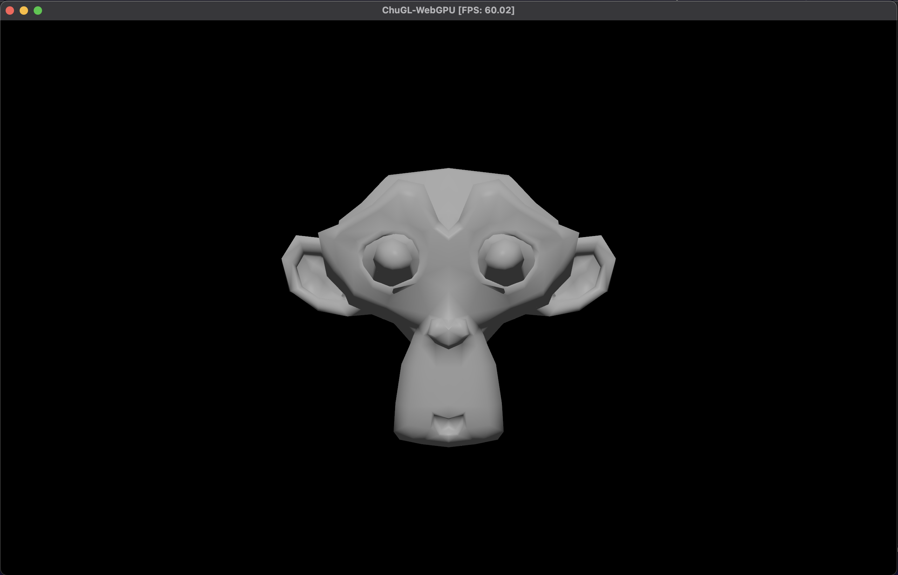

# ChuGL Example Walkthrough - Music for Airports

- [ChuGL Example Walkthrough - Music for Airports](#chugl-example-walkthrough---music-for-airports)
  - [Overview](#overview)
  - [Installing ChucK/ChuGL](#installing-chuckchugl)
  - [Running  ChucK/ChuGL](#running--chuckchugl)
    - [Troubleshooting](#troubleshooting)
  - [Hello ChuGL: Gameloop](#hello-chugl-gameloop)
    - [Troubleshooting](#troubleshooting-1)
  - [Monkeys, GGens, and Transforms](#monkeys-ggens-and-transforms)
  - [Adding Interactive Audio](#adding-interactive-audio)
  - [Envelope Generators](#envelope-generators)
  - [Tipping the Scales](#tipping-the-scales)
  - [Where there's one, there are many](#where-theres-one-there-are-many)
  - [Music for Airports](#music-for-airports)
  - [Further Resources](#further-resources)
  - [References](#references)

## Overview

This ChuGL walkthrough begins with the basics of installing and running chuck programs and ends with an audiovisual recreation of track 2/1 from Brian Eno's *Music for Airports*. Along the way, we will cover creating and drawing to a window, reading user input,  methods for synchronizing audio and graphics, and more.

## Installing ChucK/ChuGL

Follow the instructions for your operating system at: <https://chuck.stanford.edu/release/>

## Running  ChucK/ChuGL

Unlike vanilla ChucK programs, ChuGL code *cannot* currently be run through Miniaudicle. Instead, we will have to execute our programs on the **command-line**, using the `chuck` command line executable that comes with each installation.

Let's try this! Open a terminal app (on MacOS its called "Terminal", on Windows search for "Command Prompt"). Now in the terminal, type:

```shell
> chuck --version  # get chuck to print out version information

chuck version: 1.5.3.0 (chai)
   macOS | 64-bit [universal binary]
   audio driver: CoreAudio
   http://chuck.cs.princeton.edu/
   http://chuck.stanford.edu/
```

- if everything was installed correctly, you should see chuck print out the most recent version, which is `1.5.3.0 (chai)` at the time of writing this.

Now let's learn how to run chuck programs. First, make a file called `tutorial.ck`. You can do this on the command line directly like so:

```shell
# MacOS command to make a file
> touch tutorial.ck

# Windows command prompt version
> cd . > filename
```

We run this file like so:

```shell
> chuck tutorial.ck  # run the file!
empty.ck:1:1: syntax error
(empty file)
```

If everything worked correctly, you'll see chuck report the above error message. Congrats! We're ready to start writing our first audiovisual program.

### Troubleshooting

If you see output like:

```shell
> chuck tutorial.ck # running a program via command-line chuck
[chuck]: no such file: 'tutorial.ck'
```

- It means the current working directory of your terminal is *not* the same as where you created the `tutorial.ck` file. You can view the files that are present in the current directory by typing `ls`, like so:

```shell
# for macOS 
> ls # shell command
file1.ck file2.ck file3.ck # list of files in the current directory 

# for Windows CMD
> dir # shell command
file1.ck file2.ck file3.ck # list of files in the current directory 
```

If `tutorial.ck` doesn't appear, you can navigate to the correct directory by using the `cd` (short for Change Directory) command. For example, if you know you made your file at the path `~/Desktop/chugl/tutorial.ck`, you can change the directory like so:

```shell
> cd ~/Desktop/chugl # change directory
> ls # print files at current location
tutorial.ck # now we see our chuck file!  
```

- **Note**: on Windows you may have to flip the direction of the slash from `/` to `\`

On Windows this might look more like:

```shell
> cd C:\Users\andrew\Documents
> dir
tutorial.ck # now we see our chuck file!  
```

To learn more about how to use a terminal, see:

- [Mac](https://support.apple.com/guide/terminal/welcome/mac)
- [Windows](https://www.cs.princeton.edu/courses/archive/spr05/cos126/cmd-prompt.html)
- Linux: you probably already know...

## Hello ChuGL: Gameloop

Open `tutorial.ck` in your text editor of choice and write the following:

```c
while (true) {
 GG.nextFrame() => now;
}
```

- this is a "gameloop", the simplest graphical program we can write in ChuGL.

Now run this program from command-line like so

```shell
> chuck tutorial.ck
```

You should see a black window pop up like the following, which displays an FPS counter in the title.


What's going on here? `GG.nextFrame()` is a very important function that serves 2 purposes

1. creates a graphics window on the first time it's called. This window is where everything will be drawn.
2. has the calling shred pass time equal to the duration of the previous frame. (for example, if your monitor has a 60hz display, this means the shred will pass 1/60secs = ~16.7ms of time)

Doing this in a `while (true)` loop constitutes a "gameloop", which is the beating heart of every interactive graphical application. Computer graphics, like films and television, give the illusion of continuous motion by displaying static images (aka **frames**) very rapidly. Films and television show 24 frames per second, which is the minimal perceptual threshold beyond which things stop looking like powerpoints and more like continuous motion. Modern games typically target 60 frames per second. In ChuGL the framerate is determined by the refresh-rate of your monitor. On my current machine this is also 60fps.

`GG.nextFrame() => now` provides a timing mechanism for shreds to update graphics once per-frame, every frame. This is where the majority of our graphics animation code will go, as we will see shortly!

### Troubleshooting

If your window opens briefly and then immediately crashes, your graphics drivers are likely out of date. Follow the steps of your GPU hardware vendor (Nvidia, Radeon, etc.) to update to the latest version.

## Monkeys, GGens, and Transforms

Now that we have a graphics window, let's start drawing to it. Add the following code:

```c
GSuzanne suz --> GG.scene();

while (true) {
 GG.nextFrame() => now;
}
```

Running the program again, you should see:



Let's try to understand this new line of code by comparing with something we're already familiar with: audio in chuck!

```c
// comparing graphics and audio workflows

GSuzanne suz --> GG.scene(); // graphics
SinOsc   osc =>  dac;        // audio

```

- `SinOsc` in chuck is one of the many builtin sound-generators (aka "unit-generators" or UGens) which produce audio. Likewise, `GSuzanne` is one of ChuGL's builtin graphics-generators, or GGens for short.
  - Just like Chuck has multiple sound-generators (`SinOsc`, `TriOsc`, etc), ChuGL comes with multiple [primitives](https://chuck.stanford.edu/chugl/api/chugl-ggens.html)  (`GCube, GSphere, GTorus` etc.) Feel free to try them out!
- the chuck operator `=>` connects UGens to each other and speaker output, forming an *audio graph*. Likewise, the **gruck operator** `-->` connects GGens to each other, forming a **scene graph**
- The `dac` is a special UGen in chuck which outputs incoming audio through your speakers. Likewise, `GG.scene()` is a special GGen in chugl which denotes the "root" of the scene graph. `GG.scene()`, by default, is what is drawn every frame. If a GGen is *not* connected to `GG.scene()` (or any of its children), it will not be drawn.

> An aside on scene graphs:
>
> - Scene graphs are essential to nearly all 3D graphical applications, from modeling software like Blender or Maya, to animation software like Pixar's Renderman, to 3D file formats like glTF or USD, to game engines like Unity/Unreal/Godot.
> - Intuitively, a scene graph contains the info necessary for a graphics engine to know what it needs to draw to the screen.

ChuGL offers a way to view the current scenegraph through its builtin UI system. Back in your code file, add:

```c
GSuzanne suz --> GG.scene(); // connect a GGen to the scenegraph

while (true) {
 GG.nextFrame() => now;   // on every frame...

 // draw UI
 if (UI.begin("Tutorial")) {  // draw a UI window called "Tutorial"
  // scenegraph view of the current scene
  UI.scenegraph(GG.scene()); 
 }
 UI.end(); // end of UI window, must match UI.begin(...)
}
```

- Learning how to create our own UIs is beyond the scope of this walkthrough. To learn more, see the [chugl cheatsheet](https://chuck.stanford.edu/chugl/doc/cheatsheet.html#add-a-ui)

Now when you run the program, you'll see a UI window with a "scenegraph" dropdown. Click and expand it to view everything in the current scene.


- By default, ChuGL initializes the scene with a directional light (`GDirLight`) and a camera (`GCamera`)
- Suzanne is under the `GMesh` section, which you can expand to view transform and material properties
  - Note: A `GMesh` is a subclass of `GGen` that combines `Geometry` info (what shape a thing is) with `Material` parameters (what color/shading that thing is) and `GGen` transform data (*where* that thing is/oriented in 3D space)
  - In other graphics engines, `GMesh` might also be

Expanding the `GMesh` dropdown shows something like this:


The **Transform** section contains info regarding Suzanne's position, rotation, and scale in 3D space. Try changing these values yourself by clicking and dragging!

The **Material** section contains parameters for Suzanne's shading. Try changing these values to learn what they do.

Most importantly, all of these parameters are controllable in our chuck code via chugl methods. As we will see shortly, these methods are our gateway to adding interaction and audiovisual synchronization...

> Note: the scenegraph viewer does *not* save state. Any values you modify during runtime will be discarded after closing the chugl window. Its primary use is for debugging and testing out different values. If you find a sweet spot you like, remember to write/save these values somehow so you can properly add them to the code!
>
## Adding Interactive Audio

We have graphics, now let's add sound and user interaction. Back in our code file, add the following:

```c
GSuzanne suz --> GG.scene(); // connect a GGen to the scenegraph

/* NEW CODE */
TriOsc tri => dac; // connect a triangle oscillator to audio out

while (true) {
 GG.nextFrame() => now;   // on every frame...

 // draw UI
 if (UI.begin("Tutorial")) {  // draw a UI window called "Tutorial"
  // scenegraph view of the current scene
  UI.scenegraph(GG.scene()); 
 }
 UI.end(); // end of UI window, must match UI.begin(...)

 /* NEW CODE */
 // user input
 // if the key is pressed
 if (GWindow.key(GWindow.Key_Space)) { 
  .2 => tri.gain; // volume on!
 } else {
  .0 => tri.gain; // volume off!
 }
}
```

1. connect a triangle oscillator to `dac` and set its initial gain to 0
2. listen for user input via the function `GWindow.key(...)` which returns `true` as long as the given key is held down. See the [GWindow API Reference](https://chuck.stanford.edu/chugl/api/chugl-basic.html#GWindow) and [cheatsheet](https://chuck.stanford.edu/chugl/doc/cheatsheet.html#get-mousekeyboard-input) to learn more about handling user input in ChuGL.

Run `tutorial.ck` again and try pressing space! You should hear a note when the space bar is held down.

Now comes the exciting part: synchronizing audio and graphics! Let's make Suzanne react to the sound by changing their color. Back in our user input code, add the following:

```c
// inside the gameloop ...
 // user input
 // if the key is pressed
 if (GWindow.key(GWindow.Key_Space)) { 
  Color.WHITE => suz.color; // change color
  .2 => tri.gain; // volume on!
 } else {
  Color.BLACK => suz.color; // change color
  .0 => tri.gain; // volume off!
 }
// ...
```

- We can control Suzanne's diffuse color via the function `suz.color(...)`
- `Color` is a builtin color utility class. [API Rerence](https://chuck.stanford.edu/chugl/api/chugl-basic.html#Color)

Run the code again and you should observe Suzanne changing from dark to lit as we press the space bar to play sound.

Congratulations, at this point you've made your first unified audiovisual program in chuck/chugl! We finally have sound, graphics, and interaction, all working together.

> Note: This ability to seamless map sound parameters to graphics and vice versa is why we call chuck+chugl a **unified** audiovisual programming framework. There's quite a lot going on under the hood to make this synchronization work so that you, the designer, never have to think about it. If you for whatever reason *do* want to think about it, you can learn more about chugl's implementation in our [2024 NIME paper](https://mcd.stanford.edu/publish/files/2024-nime-chugl.pdf)

## Envelope Generators

Let's polish our code. One complaint is that the transitions from dark to light, silence to sound, are too jumpy. The sound, in particular, is causing an audible speaker click when we go instantly from 0 gain to .2 gain.

To smooth this out, let's introduce a new UGen, [Envelope](https://chuck.stanford.edu/doc/reference/ugens-basic.html#Envelope). This is chuck's most simple envelope generator, which is a special type of UGen that multiples the *gain* of the incoming audio signal by its current value. Intuitively, you can think of the `Envelope` as a way to gradually ramp the volume of a sound from zero to some target value, and back down again.

- There are many great resources online for learning more about envelope generators. I'd recommend [this one by Ableton](https://learningsynths.ableton.com/en/envelopes/) (In fact the entire tutorial is worth going through if you're new to sound synthesis)

Change the audio graph code to be:

```c
// OLD, remove
// TriOsc tri => dac; 
// NEW version
TriOsc tri => Envelope env => dac; 
1::second => env.duration;
```

- now we connect our triangle oscillator through an envelope before outputting to dac
- we can control the time it takes to ramp to full volume via `env.duration`

And in our user input code:

```c
// inside the gameloop ...
 // user input
 // if the key is pressed
 if (GWindow.key(GWindow.Key_Space)) { 
  Color.WHITE => suz.color; // change color
  
  // OLD delete
  // .2 => tri.gain; // volume on!
  
  // New 
  env.keyOn();
 } else {
  Color.BLACK => suz.color; // change color
  
  // OLD delete
  // .0 => tri.gain; // volume off!
  
  // New
  env.keyOff();
 }
// ...
```

- Now we use the envelope to control the gain, rather than modifying it directly ourselves. Comment out the previous calls to `tri.gain`.
- Add `env.keyOn()` and `env.keyOff()` in the appropriate places

Run the code again and you should hear that when the space bar is held, the envelope is open, ramping up to full volume. And when the space bar is released, it closes, fading the volume to 0. That fixes our audio popping issue! But wait, now the graphics are completely out of sync. Let's fix that by matching Suzanne's color to the envelope volume.

Adding to the same place in code:

```c
// inside the gameloop ...
 // user input
 // if the key is pressed
 if (GWindow.key(GWindow.Key_Space)) { 
  // OLD delete
  // Color.WHITE => suz.color; // change color
  
  env.keyOn();
 } else {
  // OLD delete
  // Color.BLACK => suz.color; // change color
  
  env.keyOff();
 }

 // NEW
 // change color according to volume
 env.value() * Color.WHITE => suz.color; 
// ...

```

- we can get the volume level of the envelope via `env.value()`, which returns a value between 1.0 and 0.0
- Delete the previous calls to `suz.color`, and instead add a new line which sets their color equal to the envelope volume *times* the color white

Running the code, you'll see that Suzanne's color is now being driven by the volume.


You might notice a flash of white when first starting the app--that is because Suzanne's default color is white, and we set it to black after the first frame. Let's fix that by changing the default to black like so:

```c
GSuzanne suz --> GG.scene(); // connect a GGen to the scenegraph
Color.BLACK => suz.color; // NEW
```

The entire program should now be:

```c
GSuzanne suz --> GG.scene(); // connect a GGen to the scenegraph
Color.BLACK => suz.color;

TriOsc tri => Envelope env => dac; // connect a triangle osc to audio out
1::second => env.duration; // time it takes to reach full volume

while (true) {
 GG.nextFrame() => now;   // on every frame...

 // draw UI
 if (UI.begin("Tutorial")) {  // draw a UI window called "Tutorial"
  // scenegraph view of the current scene
  UI.scenegraph(GG.scene()); 
 }
 UI.end(); // end of UI window, must match UI.begin(...)

 // user input
 // if the key is pressed this frame
 if (GWindow.key(GWindow.Key_Space)) { 
        env.keyOn(); // open envelope
 } else {
        env.keyOff(); // close envelope
    }

    // match color to volume
    env.value() * Color.WHITE => suz.color;
}
```

## Tipping the Scales

If we can sync color to audio, why not other parameters as well? Another idea that comes to mind is to change the scale (aka size) of Suzanne as well. We can do that like so:

```c
// in the gameloop ...

    // match color to volume
    env.value() * Color.WHITE => suz.color;
    // NEW
    // match scale to volume
    env.value() => suz.sca;
// ...
```

- the function `suz.sca` takes a single float and scales the sizes of Suzanne uniformly in all 3 dimensions
- Now Suzanne grows and shrinks along with the audio!
- You can use `scaX`, `scaY` and `scaZ` to scale along single dimensions.

## Where there's one, there are many

Now that we have 1 singing Suzanne, let's add more and begin making our example musical. We are going to refactor our code so that we have a single function which can take a few musical parameters (midi pitch, etc.) and spawn a singing Suzanne that loops endlessly. For simplicity's sake, I'll copy the end result in its entirety:

```c
// graphical coupling / animation
fun void addGraphics(Envelope env) {
    // graphics setup
    GPlane suz --> GG.scene();
    .1 => suz.sca;
    Color.BLACK => suz.color;

    // graphical loop
    while (true) {
        GG.nextFrame() => now;

        // sync color to volume
        env.value() * Color.WHITE => suz.color;
        // sync vertical scale to volume
        env.value() => suz.scaY;
    }
}

fun void addVoice(float midi, dur note_dur, dur loop_dur, dur offset) {
    // audio setup
    TriOsc osc => Envelope env => dac;
    .1 => osc.gain;
    Std.mtof(midi) => osc.freq; // set frequency
    note_dur / 2 => env.duration; // note duration

    // couple with graphics
    spork ~ addGraphics(env);

    // wait for initial offset
    offset => now;

    // audio loop
    while (true) {
        env.keyOn(); // open envelope
        note_dur / 2 => now;
        env.keyOff(); // close envelope
        note_dur / 2 => now;

        // wait for remainder of loop
        loop_dur - note_dur => now;
    }
}

// spawn a voice that plays middle C (midi 60) for 2 seconds every 3 seconds
spork ~ addVoice(60, 2::second, 3::second, 0::second);

// original gameloop
while (true) {
 GG.nextFrame() => now;   // on every frame...
}
```

- This looks like a lot of changes, but mostly it's just moving the code we already wrote into two functions:
- The `addVoice(...)` function contains our prior audio code, and takes the following parameters:
  - `float midi`: the pitch to loop
  - `dur note_dur`: the envelope duration, i.e. how long a note should sound for
  - `dur loop_dur`: loop duration
  - `dur offset`: a one-time wait before starting the infinite audio loop
- The `addGraphics(...)` function contains our prior graphics code.
  - Suzanne has been changed into a `GPlane` (since it looks more like a volume meter). But feel free to change back or to another shape of your liking.
- Notice also that all UI and keyboard interaction code in the bottom gameloop has been removed. Our new setup loops sounds on their own, so we no longer need to take user input.
- But perhaps the most important observation is that we now have 2 separate shreds, 1 for audio and 1 for graphics, each running on their own timeline. The audio shred loops every `loop_dur`, while the graphics shred infinite loops every `GG.nextFrame()`, and they communicate via shared variables (in this case via the same `Envelope` UGen). This programming pattern is one possible way to organize/structure your audiovisual interactions.

Running this code, you'll now see:


Now let's add more voices!  Below where we sporked the current voice, add a few more of your own choosing. E.g.

```c
// spawn a voice that plays middle C (midi 60) for 2 seconds every 3 seconds
spork ~ addVoice(60, 2::second, 3::second, 0::second);
spork ~ addVoice(67, 1.8::second, 2.4::second, 0::second);
spork ~ addVoice(69, 1.5::second, 2.0::second, 0::second);
```

Run your new code and...the sound should work fine, but now all our animations are stacked on top of each other. We've introduced a new sound parameter (variable pitch) but haven't incorporated a corresponding graphical one. A natural way to address this is to have pitch affect the placement of the GGen: higher pitches are shifted to the right, and lower to the left (like a piano keyboard).

The fastest way to do this is to modify the `addGraphics` like so:

```c
// graphical coupling / animation
fun void addGraphics(Envelope env, float midi) {
    // graphics setup
    GPlane suz --> GG.scene();
    .1 => suz.sca;
    Color.BLACK => suz.color;

 // NEW
 // place location according to pitch
    Math.remap(
        midi,      // value
        53, 68,    // value range
        -2.0, 2.0  // output range 
    ) => suz.posX;

    // graphical loop
    while (true) {
        GG.nextFrame() => now;

        // sync color to volume
        env.value() * Color.WHITE => suz.color;
        // sync vertical scale to volume
        env.value() => suz.scaY;
    }
}

// modify the call to addGraphics in addVoice(), passing in the midi parameter
 // ...
 // NEW
    spork ~ addGraphics(env, midi);
    // ...
```

- we add a parameter `float midi` to our `addGraphics(...)` function
- Use the [Math.remap](https://chuck.stanford.edu/doc/reference/base.html#Math) function from chuck's math library to convert a midi number into a the X coordinate of our shape.
  - Math.remap is a builtin linear-interpolator. It takes an input value within a given range, and remaps it to its equivalent position in an output range.
  - To learn more about remapping, as well as its building blocks lerp and inverse lerp, check out this [presentation](https://youtu.be/NzjF1pdlK7Y?si=kx4ck3mB3wT7xwQs&t=550) by indie game dev Freya Holmer

Assuming you sporked the same midi note values for your voices, running the program now looks like


And, while we're at it, let's run our voices through some reverb...

```c
// initialize reverb UGen
NRev rev => dac;
.5 => rev.mix;

fun void addVoice(float midi, dur note_dur, dur loop_dur, dur offset) {
    // audio setup
    // OLD delete
    // TriOsc osc => Envelope env => dac;
    // NEW
    TriOsc osc => Envelope env => rev;
```

- above `addVoice` we connect a reverb UGen `NRev` to the dac
- and in `addVoice` we now patch our envelope to this reverb instead

...and adjust our graphics code so that the planes stay slightly visible through silence:

```c
// inside the addGraphics(...) function
    // graphical loop
    while (true) {
        GG.nextFrame() => now;

        // sync color to volume
        // OLD
        // env.value() * Color.WHITE => suz.color;
        // NEW
        (.1 + env.value()) * Color.WHITE => suz.color;
        
        // sync vertical scale to volume
        // OLD
        // env.value() => suz.scaY;
        // NEW
        .05 + env.value() => suz.scaY;
    }
```

- add the constants `.1` and `.05` to our animation code so they values never reach 0.

## Music for Airports

We now have all the components we need to recreate track 2/1 from Brian Eno's *Music for Airports*.

In place of your current calls to `addVoice(...)`, copy these magic numbers instead:

```c
spork ~ addVoice(60, 7.7::second, 20.1::second, 1::second + 0.0::second); // C
spork ~ addVoice(63, 7.1::second, 16.2::second, 1::second + 1.9::second); // Eb
spork ~ addVoice(65, 8.5::second, 19.6::second, 1::second + 6.5::second); // F
spork ~ addVoice(53, 9.1::second, 24.7::second, 1::second + 6.7::second); // low F
spork ~ addVoice(68, 9.4::second, 17.8::second, 1::second + 8.2::second); // Ab
spork ~ addVoice(56, 7.9::second, 21.3::second, 1::second + 9.6::second); // low Ab
spork ~ addVoice(61, 9.2::second, 31.8::second, 1::second + 15.0::second); // Db
```

Sit back, watch, listen, and enjoy!


The final walkthrough code:

```c
// graphical coupling / animation
fun void addGraphics(Envelope env, float midi) {
    // graphics setup
    GPlane suz --> GG.scene();
    .1 => suz.sca;
    Color.BLACK => suz.color;

    // place location according to pitch
    Math.remap(
        midi,      // value
        53, 68,    // value range
        -2.0, 2.0  // output range 
    ) => suz.posX;

    // graphical loop
    while (true) {
        GG.nextFrame() => now;

        // sync color to volume
        (.1 + env.value()) * Color.WHITE => suz.color;
        // sync vertical scale to volume
        .05 + env.value() => suz.scaY;
    }
}

// initialize reverb UGen
NRev rev => dac;
.5 => rev.mix;

fun void addVoice(float midi, dur note_dur, dur loop_dur, dur offset) {
    // audio setup
    TriOsc osc => Envelope env => rev;
    .1 => osc.gain;
    Std.mtof(midi) => osc.freq; // set frequency
    note_dur / 2 => env.duration; // note duration

    // couple with graphics
    spork ~ addGraphics(env, midi);

    // wait for initial offset
    offset => now;

    // audio loop
    while (true) {
        env.keyOn(); // open envelope
        note_dur / 2 => now;
        env.keyOff(); // close envelope
        note_dur / 2 => now;

        // wait for remainder of loop
        loop_dur - note_dur => now;
    }
}

// Music for Airports
spork ~ addVoice(60, 7.7::second, 20.1::second, 1::second + 0.0::second); // C
spork ~ addVoice(63, 7.1::second, 16.2::second, 1::second + 1.9::second); // Eb
spork ~ addVoice(65, 8.5::second, 19.6::second, 1::second + 6.5::second); // F
spork ~ addVoice(53, 9.1::second, 24.7::second, 1::second + 6.7::second); // low F
spork ~ addVoice(68, 9.4::second, 17.8::second, 1::second + 8.2::second); // Ab
spork ~ addVoice(56, 7.9::second, 21.3::second, 1::second + 9.6::second); // low Ab
spork ~ addVoice(61, 9.2::second, 31.8::second, 1::second + 15.0::second); // Db

while (true) {
    GG.nextFrame() => now;   // on every frame...
}
```

## Further Resources

- [music_for_airports.ck](https://chuck.stanford.edu/chugl/examples/sequencers/music_for_airports.ck)
- [ChuGL cheatsheet](https://chuck.stanford.edu/chugl/doc/cheatsheet.html)
- [CHuGL API Reference](https://chuck.stanford.edu/chugl/api/)
- [More examples](https://chuck.stanford.edu/chugl/examples/)

## References

- <https://teropa.info/blog/2016/07/28/javascript-systems-music.html>
- <https://reverbmachine.com/blog/deconstructing-brian-eno-music-for-airports/>
