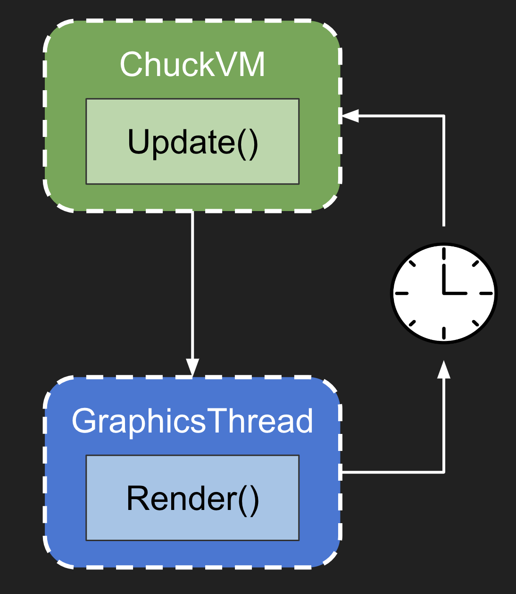

# ChuGL Tutorial

## (WORK IN PROGRESS)

## 

## Sections
- optimizations (sharing geometry and materials)
- core features
  - materials
  - textures
  - geometries
  - meshes
  - camera
  - lights
  - scene
    - all the defaults

## The Gameloop


The heartbeat of any realtime graphics system is its *gameloop* function, which is computed once per frame. In class Ge showed everyone *audio buffer callbacks*, i.e. some function in the inner loop which computes the upcoming audio buffer on-demand so that it may be sent to the audio driver and then eventually be played back as sound. UGens (ChucK's sound generators), for example, all implement a `tick()` function which is called at *audio rate* (typically 44.1khz or 48khz) to compute a sample of sound at that particular moment in time.

In ChuGL we can think of the gameloop as exactly analagous, but instead of computing values which ultimately determine the displacement of a speaker cone over time, we are computing values which determine the color of pixels on your screen in space. Also, the gameloop function is called at *framerate* not audio rate (typically 60-120hz, depending on the refresh rate of your monitor), and rather than computing multiple samples for a single *audio buffer* (ChucK defaults to a buffsize of 256 samps),  we are computing typically millions of colors values for a single *frame buffer*. I know that's a lot of terminology and abstraction, but the key point is that what's happening in audio and in graphics really aren't so different; and because ChuGL is a unified audiovisual programming environment, understanding these parallels will make using this tool all the more intuitive.

So the gameloop decides what's drawn on screen each frame, but what's actually happening inside? How will it know to draw all the mesmerizing patterns you envision for your next audio visualizer?



The above diagram shows that at the highest and simplest level, the gameloop can be broken into just 2 parts: 
1. updating state (the green `Update()` block) and...
2. drawing that state. (the blue `Render()` block)
  
Updating state includes logic such as reading mouse/keyboard input to determine the position and rotation of a player character in the world. Drawing that state includes packaging and sending all the geometry information (vertex data, shader uniforms, etc) about said player character to the GPU, and running all that data through the [3D rendering pipeline](https://www.khronos.org/opengl/wiki/Rendering_Pipeline_Overview#:~:text=The%20OpenGL%20rendering%20pipeline%20is,for%20the%20programmable%20pipeline%20stages.) to compute color values for the pixels on screen.  Breaking it down further: in `Update()` you're working with abstractions like transforms, what level am I on, how much health do I have, mapping player input... whereas `Render()` is about breaking those abstractions down into floating point values and data buffers which can be sent to and understood by the GPU, taking advantage of its massive parallelism to *draw things fast*, all in time for the next iteration. `Update()`, therefore, tends to be high-level, written in an interpreted scripting language (like Lua, Python, or Chuck), and CPU-bound. Whereas `Render()` is low-level interfacing directly with GPU drivers, implemented in compiled languages like C++ or Rust, and GPU-bound.

Of course there are exceptions to this pattern and endless complexities in the nitty-gritty, but this core architecture of `Update()` <--> `Render()` and CPU <--> GPU has remained remarkably stable ever since the inception of modern graphics APIs.

Okay enough with the theory! What do I actually need to code to draw pretty things in ChuGL?? ChuGL is a [**Retained Mode API**](https://en.wikipedia.org/wiki/Retained_mode), meaning all the `Render()` logic (which is 90% bookkeeping anyways) is handled for you by the ChuGL rendering backend. *All you need to write is update*, as shown in the diagram above. For example, after instantiating a `GSphere`, updating it's position will also update where it's drawn in the world. You do NOT have to save this position and issue a separate draw command like `DrawSphere(newPosition)` as you would in [Immediate Mode APIs](https://en.wikipedia.org/wiki/Immediate_mode_(computer_graphics)) such as [Processing](https://processing.org/) and [LOVE](https://love2d.org/). This places a lot more responsibility and complexity on the ChuGL backend, but hopefully empowers you the chucker to spend more time writing creative code.

A minimal gameloop in ChuGL looks like this:

```cpp
while (true) {
  GG.nextFrame() => now;
}
```

A quick breakdown
- `GG.nextFrame()` is the equivalent of `Render()`. It's ChucK VM thread telling the ChuGL rendering thread: "hey I'm done updating the state, now draw it". `nextFrame()` returns an event that this chuck shred will wait on (by piping it `=> now`) while the render thread does stuff to prepare all the newly-updated state for drawing
- When the renderer is done, it broadcasts a wakeup signal back to the chuck shred, to move onto the next iteration of the gameloop
- ChucK events work in a way that while being waited on, other shreds are not blocked and continue to compute audio data! So no need to worry about dropping samples!
- In addition, ChuGL is architected in a way that the prepwork it has to do in .nextFrame() runs in constant O(1) time, and does not depend on the number/complexity of the updates you just gave it. It's *fast* and will never itself be a bottleneck in your program.
- This example is minimal because there isn't actually any update() logic

Taking one more step:

```cpp
fun void update() {
  // your update logic here...
  // e.g. let's change the background color!
  GG.scene().backgroundColor(
    (.5 * Math.sin(now/second) + .5) * @(1,1,1) // white
  );
}

while (true) {
  update()               // update()
  GG.nextFrame() => now; // render()
}
```

- Now we've introduced an actual update function which oscillates the color of the window between black and white.
- Waiting on `GG.nextFrame()` introduces a timing mechanism that ensures update() will only be called once per frame
- Having more updates or trying to draw more complex scenes will lower the framerate, and therefore decrease the rate that `update()` is called on chuck-side

All the details aside, hopefully these minimal code examples are clear. You can just shove all your update logic in the `while(true)` loop itself, and call `GG.nextFrame()` when you're done.

But what if your scene starts getting more complex? Imagine trying to make a game with dozens of entities such as player, enemies, projectiles and a reactive soundtrack to boot! Trying to put all that logic in this one gameloop is just not scalable. Let's take a look at a couple other ways to encapsulate and organize updates...

### The Many Ways to Update()

#### Sporking Gameloop Shreds

A defining feature of Chuck is its strongly-timed, deterministic, user-space threading, aka **shreds**. Just like we can spork shreds to compute audio in parallel, say for multiple instruments at the same time, we can also spork shreds to update graphics in parallel, e.g. for many entities that act independently but are on screen at the same time.

Here's an example:
```cpp

// audio shred
fun void SoundTrack() {
  // patch UGens, create your snazzy generative soundtrack
  // ...
}

// player update logic
fun void PlayerUpdater() {
  while (true) {
    // respond to mouse and kbd input to move the player
    // ...
    GG.nextFrame() => now;
  }
} spork ~ PlayerUpdater();

// enemy update logic
fun void EnemyUpdater() {
  while (true) {
    // your amazing enemy AI code here
    // ....
    GG.nextFrame() => now;
  }
} spork ~ EnemyUpdater();

// same gameloop as usual
while (true) { GG.nextFrame() => now; }
```
Breakdown:
- `SoundTrack()` is your typical audio shred
- `PlayerUpdater()` and `EnemyUpdater()` are separate graphics shreds that compute update logic for their own entities (the player and enemy, respectively).
- **Important**: these shreds must also call `GG.nextFrame() => now`! This accomplishes 2 things
  1. Waiting on the Chuck Event returned by `nextFrame()` throttles the while-loop to run exactly once per frame. Any more often you're doing unnecessary work because only the most recent update will get drawn to screen anyways. Any less often and you're potentially missing frames, resulting in choppy, unresponsive animation.
  2. Calling `.nextFrame()` also registers the calling shred with the ChuGL backend, so *ChuGL knows to wait for all shreds to finish their update logic before kicking off the next Render()*. E.g. in our above code snippet 3 shreds are calling `GG.nextFrame()`, so each gameloop ChuGL knows that once `.nextFrame()` has been called 3 times, the update logic is done for this cycle and it can now begin rendering. Otherwise ChuGL might kick off the render before a shred has finished its update-logic, again resulting in choppy or delayed visuals.


#### Extending GGens

You can already go a long way with the previous approach but wait, `Player` and `Enemy` in the code above sound a lot like classes, and ChucK supports object-oriented programming, right? Wouldn't it be "cleaner" if we could define classes with their own `Update()` functions (like how Unity does it?) and not have to worry about calling `nextFrame()` or sporking or any of that?

Thanks to some serious VM hackery by Ge you can do just that! Every GGen has an `update()` member function that by default does nothing, but which you can override by creating your own class which extends GGen!

Using this OOP approach, the above code could look something like:

```cpp
class Player extends GGen 
{
  // put your player methods and data here

  // override the update function. 
  // IMPORTANT: the name and signature must match *exactly*
  fun void update(float dt) {
    // in goes the same update logic ...
  }
}

class Enemy extends GGen
{
  // same stuff, state and methods
  fun void update(float dt) {
    // chase the player, play the banjo threateningly, etc...
  }
}

Player p;  // instantiate a player
Enemy enemies[100];  // instantiate multiple enemies!

// same old gameloop
while (true) { GG.nextFrame() => now; }
```

Now what's going on?
- Player and Enemy are now GGens, which can themselves be containers of multiple GGens and be grucked direclty into the scene
- A new update function `fun void update(float dt)` that overrides the default
  - It's analagous to the `tick()` defined by every UGen, and how you can extend Chugens and implement your own `tick()` audio function 
  - `float dt` is the deltatime in seconds since the last gameloop iteration. E.g. if your app is running at 60FPS, the dt will be around 1/60 = .01667 seconds.
    - Use this deltaTime to drive animations so that they run *independent of framerate*
  - **No more need to call `GG.nextFrame()!`**
- How many shreds are left now? Just 1: the main gameloop that's been there since the very beginning.

How this all works: after every registered shred has called `nextFrame()` (which is just 1 in the above code snippet), ChuGL will *walk the scenegraph in depth-first order*, starting from the the root `GG.scene()`, and automatically call `update(float dt)` on all connected GGens.
- **Note:** Parent updates are therefore called before children. So if update order matters, work around this carefully!! Or just use the simpler sporking method.
- If your custom GGen class also instantiates and contains other custom GGens, those updates will also be called automatically 
- Overloading `update(float dt)` in your custom GGen classes is completely optional

#### Yet another way: continuous vs discrete updates

So far all the ways we've covered involve creating a function that's called every frame in an infinite loop. This method method works well for  achieving the illusion of **continuous** visual effects, like smooth animation. (Think how movies are just *really* fast slideshows).

But what about things that don't change so frequently, or are one-off **discrete** events? E.g. changing the background color every quarter-note or making your visualizer pulse in-beat with the soundtrack? Trying to work these discrete changes into the continuous `update()` methods from before is unintuitive and quickly becomes unwieldy. Instead, there's a much simpler way:

```cpp
// Set the background color to a random shade of gray every quarter note
fun void bgColorer(dur qt_note) {
  while (true) {
    Math.random2f(0,1) => float intensity;
    intensity * @(1, 1, 1) => GG.scene().backgroundColor;
    qt_note => now;
  }
} spork  ~ bgColorer();

// pulse!
fun void pulser(Event @ pulseEvent) {
  while (true) {
    pulseEvent => now;
    doPulse();  // make a shrinking value suddenly large again!
  }
} spork ~ pulser();
```

The breakdown:
- This way of handling discrete updates is particularly elegant because it's exactly what ChucK was designed for, only now we're controlling visuals instead of audio
- no `nextFrame()` and no `update()`, instead we either listen for an Event or chuck some time to now, and *just do the thing when it needs to be done*
- ChuGL's underlying synchronization mechanisms will ensure these discrete updates get propagated to the very next frame

> Exercise: why don't we need to call `nextFrame()` in these discrete scenarios?

Note that this update pattern also lends itself well to handling input controls e.g. mouse clicks or key presses. 

#### Mysteries of Time: one way that somehow DOESN'T work

Seeing the discrete update pattern above might give you the idea: if I just do a discrete update really fast, say 60 times per second, won't that have the same effect as all those continuous update methods then? Wait, why have the `nextFrame()` logic and all that setup at all then? Instead, how about something like:

```
GCube cube --> GG.scene();
(1.0/60.0) => float dt;
while (true) {
  dt => cube.rotY;  // animate something, anything
  dt => now;  // wait 1/60th of a second
}
```

From reading the code, it looks like the cube should now be animating at 60fps and look buttery smooth. Elegant and simple...but as it turns out, also too good to be true.

Run this code for yourself. What do you see? Surprised? We certainly were.

The reason the code above *doesn't* work is really something I'm still wrapping my head around and gets to the very heart of how computers handle "time" as it relates to either audio or graphics. In short, audio-time and graphics-time *are not the same "Time"*, and the challenge of synchronizing the two in realtime is what  motivated and guided the entire ChuGL architecture. We're obviously as biased as it gets, but this mystery is also what makes ChuGL a unique, non-trivial, and powerful tool for audiovisual design. 

So in short, don't do this! Use the other update() methods outlined above. 

And for the curious reader I'll leave these questions: 
> Exercise: Why doesn't the above code work??? What's really going on here?

___

## The Scene Graph


The above image shows an example scenegraph for [three.js](https://threejs.org/manual/#en/fundamentals) a 3D graphics library for the web.

Scene Graphs are a datastructure for organizing 3D objects in parent-child hierarchies. A Scene Graph in ChuGL is composed of GGen's, which are the base class for anything with a *transform,* i.e. exists in 3-dimensional space. Transforms consist of 3 parts:

1. Position: a vec3 describing x,y,z coordinates in local space
2. Rotation: a vec3 describing rotation along the x,y,z axis in local space
3. Scale: a vec3 describing stretching/scaling along the x,y,z axis in local space

Notice how all these components of the transform are in **local space**, which you can think of relative position/rotation/scale. Before drawing anything, the render thread needs to convert all this transform data into **world space**, which is like absolute position/rotation/scale. It computes this by going down the scenegraph, from root to leaves, and compounding transforms along the way.
- E.g. if a parent GGen has worldspace position (1,0,0) and its child has local space position (2,0,1), what would the child's world-space position be?
  - answer: (1,0,0) + (2, 0, 1) = (3,0,1)
- Rotation is similarly compounded with addition, whereas scale is multiplied
- See the ChuGL [orbits](https://chuck.stanford.edu/chugl/examples/basic/orbits.ck) example for clear code and illustration of how the scenegraph can be used to control transforms.

### Grucking

In ChuGL, GGens are connected/disconnected to the scenegraph with the **gruck/ungruck** operators `-->` and `--<`. Something like `A --> B` has 2 effects:
1. `A` is now the child of `B` and will therefore inherit all of B's transform data (e.g. A will be translated by the position of B, A will be rotated by how much B is rotated, and scaled by how much B is scaled)
2. `A` will now be connected to the main scene, and be picked up in both the update pass and the draw pass

Point 2 is especially important so I'll reiterate: ChuGL will only call `update(float dt)` and will only draw those GGens which are connected to the root of the main scene, accessed via `GG.scene()`. This is why, for say a sphere to appear, you have to connect it to the scene like so: `GSphere s --> GG.scene();`

Likewise, if you have some `class Player extends GGen` with its own overriden `update(float dt)` function, that update will only be called if the Player instance is also grucked to the main scene.

As a corollary, if you want to *disable* a GGen, i.e. stop drawing it and have ChuGL stop calling it's `update()` function, simply disconnect it from the scene:

```
// every second we either disconnect or reconnect the sphere to the scene, toggling whether or not it will be drawn
GSphere s;
while (true) {
  s --> GG.scene();  // connect and draw
  1::second => now; 
  s --< GG.scene();  // disconnect and stop drawing
  1::second => now;
}
```

Some other notes about these scenegraph connections:
- a GGen can only have 1 parent, but can have any number of children
- a GGen cannot be connected to itself
- the scenegraph is acyclic, i.e. A cannot be both a parent AND child of B. 
  - If A is already a parent of B, setting B to be the parent of A will implicitly replace the previous connection.

```
GGen B --> GGen A;  // parent A to B
A --> B;  // implicitly first de-parents A from B
```

Who decided to call these things parents and children? Idk but it makes all the scenegraph relationship code look awfully morbid....

### GScene

The root GGen of any ChuGL project is the main scene, accessed via `GG.scene()`. This is a static scene instance, so instantiating a separate scene object via `GScene scene` will just create another pointer to the same global scene object.

The ChuGL renderer will always take this main scene `GG.scene()` as the root and origin of the world. For all the update and draw passes, it starts there and does a DFS downwards through children. By default the mainscene has no parent, and making it the child of some other GGen will have no effect.

By default, the `GScene` comes with 2 children:
1. the main camera, `GG.camera()`
2. a default directional light, `GG.light()`

In addition, the scene GGen stores state regarding global, scene-wide visual information like background color or fog information.


### Further Reading

[ThreeJS Fundamentals: Scenegraph](https://threejs.org/manual/#en/scenegraph): Part of the a tutorial for threejs, a javascript 3D library for the web which is a primary inspiration for ChuGL's own scenegraph design

[Learn OpenGL: Scene Graphs](https://learnopengl.com/Guest-Articles/2021/Scene/Scene-Graph): another great resource for learning low-level graphics graphics programming general. 

___

## Optimizations + Do's and Dont's

As a rule of thumb you should never optimize until you have to, (1) because the more optimized code is, the more locked-in and inflexible it comes, reducing your avenues for creative exploration, and (2) you can't actually know what to optimize until the slow code exists in the first place.

But since we're programming realtime audiovisual systems in the class, it may frequently be the case that you do have to optimize. Running in realtime has strict performance requirements:
- For graphics running at 60FPS, you have 16.7ms to compute all your update logic each frame. Miss this deadline and your visuals will start to stutter and at worst freeze
- For audio running at 48khz sampling rate, 256 sample buffsize (which is the default for ChucK on MacOS), ChucK has a measly 5.3ms to generate each audio buffer. Miss this deadline and it'll sound like some terrible creature is trying to scratch and claw its way out of your speakers

So if you ever notice any of the above or your project just feels slow/sluggish to use, here's some tips that may help.

### Don't Pass Time in the update() logic

For example,

```cpp
while (true) {
  update(); 
  10::ms => now;  // NEVER DO THIS
  GG.nextFrame() => now;
}
```

Passing time in the gameloop or update functions will just artificially reduce your framerate. If you need to pass time to do musical timing, spork and do it in a separate shred. 

### Audio Problems in an Audio-First Engine

"I'm noticing the audio is starting to crackle and drop samples, will reducing the amount of geometry/visual complexity of my scene help?"

Short answer: no.

Long answer: no, because ChuGL is an **Audio-First** graphics engine. Unlike other game frameworks where you can dispatch audio calls from the main thread, ChuGL is the reverse--audio takes priority, and the audio thread controls when the render thread draws. Graphics blocks on audio, not the other way around. Doing a lot of compute in ChucK can slow your update logic and therefore reduce the framerate, but long drawtimes in the renderer *will never* slow down audio synthesis.

So if your audio is suffering, either
1. look at how you're using UGens. Load SndBufs and instantiate UGens on program startup, rather than during inner loops
2. Reduce the complexity of your update logic. E.g. drawing 1,000,000 points might be ok, but looping over a million points in chuck every frame to change some value might be to expensive, depending on your machine.

### Speeding up Load Times -- Sharing Geometry and Materials

Run the following code and you'll probably have to wait several seconds for the window to load:

```cpp
GSphere spheres[512];
for (auto s : spheres)
  s --> GG.scene()

while (true) { GG.nextFrame() => now; }
```

What's going on here? Why is adding 1 sphere instant, but 512 spheres so slow? To answer this question, first we'll have to break down what exactly is a `GMesh`, the parent class of GSphere.

#### What is a Mesh?

GMesh is simply a container for 2 other ChuGL data types: `Geometry` and `Material`. 

`Geometry` classes describe the geometry, i.e. vertex, data for a GMesh. The `BoxGeometry`, for example, contains vertex data for the 8 points that make a cube. This vertex data is comprised of:
- positions (3 floats xyz per vert)
- colors (4 floats rgba)
- UVs (2 floats for texcoords U and V)
- Normals (3 floats for a normalized xyz directional vector)

`Material` classes meanwhile describe how a shape described by `Geometry` actually looks on screen. I.e. what color are the pixels that make up the surfaces described by the geometry? Different materials have different logic for picking pixel color. E.g. `PhongMaterial` uses a basic diffuse/specular lighting model to decide, whereas `MangoUVMaterial` just inserts texture coordinates into the red and green channels. On the renderer side, a `Material` represents a combination of vertex shader, fragment shader, and shader uniforms (don't worry if you don't know what those are!)

A `GMesh` then is simply a pairing of `Geometry` + `Material`, combined with it's own transform of position/rotation/scale so that the renderer knows where to draw this mesh in the world. To reiterate, a GMesh contains these 3 pieces of info needed for the GPU to draw a 3D object on screen:
1. vertex data, stored in mesh geometry
2. shaders + uniform parameters, stored in the mesh material
3. transform, i.e. the position/rotation/scale stored by every GGen

Given a mesh, we can access any one of these fields

```cpp
GMesh mesh;
mesh.mat();  // reference to its underlying material
mesh.geo();  // reference to its underlying geometry
```

#### G(Types) vs GMesh

Now we're ready to tackle the question -- what exactly is a `GSphere`, or a `GCube`, or any of these GGens which inherit `GMesh`? They are just convenience abstractions that create a `GMesh` with a preset material and geometry. For example, the following two spheres are equivalent from a data perspective:


```cpp
GSphere s1;

GMesh s2;
SphereGeometry sphereGeo;
PhongMaterial phongMat;
s2.set(sphereGeo, phongMat);
```

Using `GSphere` just saves you the effort of manually creating the appropriate material / geometry for what you want. Likewise `GCircle` initializes its mesh with `CircleGeometry`, `GTorus` with `TorusGeometry` etc.

This becomes a performance problem however when the number of spheres grows large. 512 `GSpheres` will also instantiate 512 different `SphereGeometries` and 512 `PhongMaterials`, and each of these then needs to be copied to the render thread, processed, and eventually loaded onto the GPU. Compiling/linking 512 shader programs, in particular, is going to take a lot of time. And assuming all you want to do is change each sphere's transform, this duplication is totally unnecessary! *All the spheres can share the same 1 geometry and material instance*. That looks something like:

```cpp
SphereGeometry sphereGeo;
PhongMaterial phongMat;
GMesh spheres[512];

// have all sphere meshes share the same geometry and material
for (auto s : spheres) {
  s.set(sphereGeo, phongMat);
  s --> GG.scene();
}

while (true) { GG.nextFrame(); }
```

Run this code and you'll see how much faster it is than creating 512 `GSpheres` directly.

**Takeaway:** when you have lots of the same ggen, see if all those instances can share resources like geometry or material.

### Pre-loading Resources

By "resources" I mean pretty much anything in ChuGL that's *not* a GGen, but is used by GGens to determine appearance. This includes types like `Geometry`, `Material`, and `Texture`. Each of these resource types has an initialization process that involves setting up state in the GPU, and can therefore hamper renderer performance! 

Say you have a complex geometry that has millions of vertices. If you instantiate it during the gameloop, you'll probably get a sudden FPS drop because the renderer suddenly has to send all that data to the GPU. A better practice is to push all that work to program start.

The `FileTexture` class in particular is slow because it requires IO to read data from a given filepath. If you want to switch between 2 textures say, every second, it's much faster to preload *both* textures separately at starttime, and switch which texture you're using, rather than just have 1 texture that constantly reloads either filepath.

The slow way:
```cpp
GPlane plane --> GG.scene();
FileTexture tex;

// assign texture to the plane material
plane.mat().diffuseMap(tex);

fun void textureSwapper() {
  while (true) {
    tex.path("logo1.png");  // fps drop
    1::second => now;
    tex.path("logo2.png");  // fps drop
    1::second => now;
  }
} ~ spork textureSwapper();
```

The fast way:
```cpp
GPlane plane --> GG.scene();
FileTexture tex1, tex2;

// all IO happens here, at program start
tex1.path("logo1.png");
tex2.path("logo2.png");

// no fps dips! 
fun void textureSwapper() {
  while (true) {
    plane.mat().diffuseMap(tex1)
    1::second => now;
    plane.mat().diffuseMap(tex2)
    1::second => now;
  }
} ~ spork textureSwapper();
```

**Takeaway**: This pattern of creating all the types you need at startup and switching between those, rather than transforming the type of a single thing during runtime, can be applied to Materials and Geometry and anything else as well.

### Simplifying Geometry

TODO

### Reducing Draw Calls

  - reducing draw calls by setting single lines/points geometry


## ChuGL Shader Programming

## end: toby fox tweet
