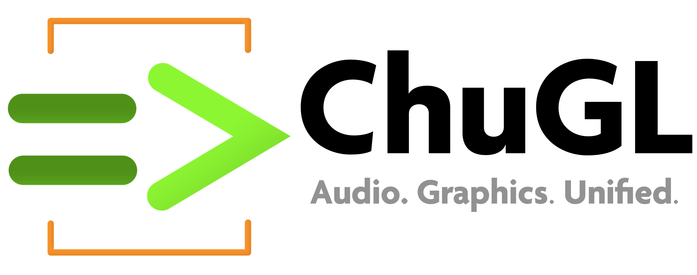
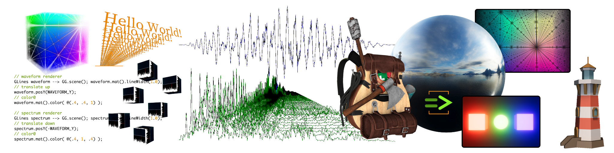

<div align="center">
<!-- Add ChuGL logo -->
<!--  -->


<h2>ChuGL =&gt; ChucK Graphics Library</h2>

</div> <!-- end center -->

<p align="justify">

<b>ChuGL</b> (sounds like "chuckle"; rhymes with "juggle") is a unified 
audiovisual programming framework built into the <a target="_blank" 
href="../">ChucK</a> programming language. It combines ChucK's 
<b>strongly-timed, concurrent programming model</b> and <b>real-time audio 
synthesis</b> capabilities with a <b>hardware-accelerated 3D graphics 
engine and API</b>. At its core is a scenegraph architecture that provides 
<b>low-latency, high performance audiovisual synchronization at 
frame-level accuracy</b>.

ChuGL was created by <a href="https://ccrma.stanford.edu/~azaday/">Andrew 
Zhu Aday</a> and <a href="https://ccrma.stanford.edu/~ge/">Ge Wang</a>, 
with support from the <a 
href="../doc/authors.html">ChucK Team</a>, and 
benefitted from prior prototypes of ChuGL and GLucK by Spencer Salazar and 
Philip Davidson.
</p>



---

**ChuGL v0.1.5** (alpha) — [**ChuGL API Reference**](./api/)
• [**Examples**](./examples/)
• [**Cheatsheet**](./doc/cheatsheet.html/)
• [**Tutorial**](./doc/tutorial.html)
• [**Paper (NIME 2024)**](https://mcd.stanford.edu/publish/files/2024-nime-chugl.pdf)
<br>
**Videos** [SoundBulb Audiovisualizer](https://www.youtube.com/watch?v=wnSmS_y9-Cs) 
| [Selected Student Projects](https://vimeo.com/909845445)
___

## Installation

### macOS and Windows

As of ChucK 1.5.2.1, ChuGL (alpha) is part of the [**standard ChucK 
distribution**](https://chuck.stanford.edu/release/) on macOS and Windows. ChucK 1.5.2.5 contains 
the latest and last OpenGL-based ChuGL v0.1.5 (alpha). ChucK 1.5.3.0 introduces ChuGL v0.2.0 
(alpha) featuring a significant re-write and transition from OpenGL to WebGPU as the underlying 
graphics library.


### Linux

Build ChuGL from source; see <a target="_blank" href="https://github.com/ccrma/chugl#building-chugl">instructions</a>.

## Running

**Note:** currently ChuGL only supports command-line chuck. MiniAudicle support to come soon. 
To run any ChuGL program (e.g., example.ck) on the terminal / command line prompt:
```
> chuck example.ck
```

### Minimal Example

If the chugin is properly loaded, running the following example via commandline chuck will 
open a blank window. Press `esc` to exit.

```cpp
while (true) { GG.nextFrame() => now; }
```

Congrats, you now have ChuGL properly installed!

## Learning Resouces

- [API Reference](./api/)
- [Examples](./examples/)
- [ChuGL Cheatsheet](./doc/cheatsheet.html)
- [ChuGL Tutorial](./doc/tutorial.html)
