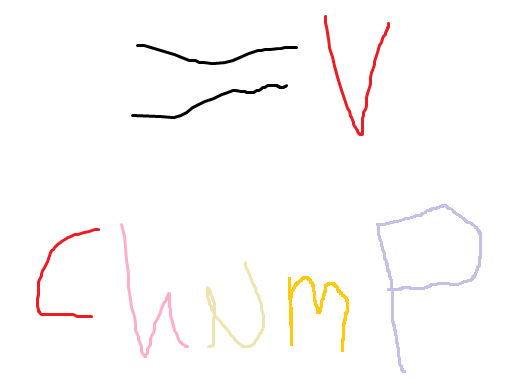

<div align="center">

</img>

<h2>ChuMP: The ChucK Manager of Packages</h2>

</div> <!-- end center -->

<p align="justify">

<b>ChuMP</b> is ChucK's official package manager. It downloads, installs, and all around manages external effects, Chugins, tools, etc. so that you don't have to.

ChuMP was created by <a href="https://nicholasshaheed.com/">Nick Shaheed</a>
with support from the <a href="../doc/authors.html">ChucK Team</a>.

---

**ChuMP v0.0.1** (alpha) — [**How to use ChuMP**](./how_to_use)
• [**Building for Linux**](./building_for_linux)
• [**Browse Packages**](./doc/smuckish.html)
• [**How to Define a Package**](./doc/walkthru.html)

---

ChuMP is bundled with the ChucK installer since `1.5.5.0` and is available as the command `chump` in your terminal. If you are on Linux, see [**Building for Linux**](./doc/cheatsheet.html).

To install a package:

```txt
chump install WarpBuf
```

To update a package:

```txt
chump update WarpBuf
```

To uninstall a package:

```txt
chump uninstall WarpBuf
```

To list available packages:
```txt
chump list
```

To list all installed packages:
```txt
chump list -i
```

To get detailed information about a package:

```txt
chump info WarpBuf
```


To display ChuMP's help page:
```txt
chump help
```

For a more in-depth explanation, see [**How to use ChuMP**](./how_to_use).
