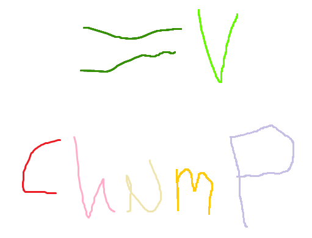

<div align="center">

</img>

<h2>How to Use ChuMP</h2>

</div> <!-- end center -->

<p align="justify">

Because ChucK is not distributed as an installer on Linux, you will need to build ChuMP from source.

---

[**ChuMP v0.0.1**](./index.html) (alpha) — [**Browse Packages**](../release/chump/)
• [**Building for Linux**](./linux-build.html)
• [**Using ChuMP**](./usage.html)
• [**Defining a New Package**](./walkthru.html)

---

**Prerequisites**

Building ChuMP requires [Meson](https://mesonbuild.com/SimpleStart.html).


**Building ChuMP**

To build ChuMP, first clone the ChuMP [GitHub repository](https://github.com/ccrma/chump):

```txt
git clone https://github.com/ccrma/chump.git
```

Then go into the ChuMP directory:

```txt
cd chump
```

Next, compile ChuMP:

```txt
make linux
```

The ChuMP binary is found at `./builddir-release/chump-cli/chump`. If you to install `chump` into your system path:

```txt
make install # this can potentially require sudo
```

And that's it!


