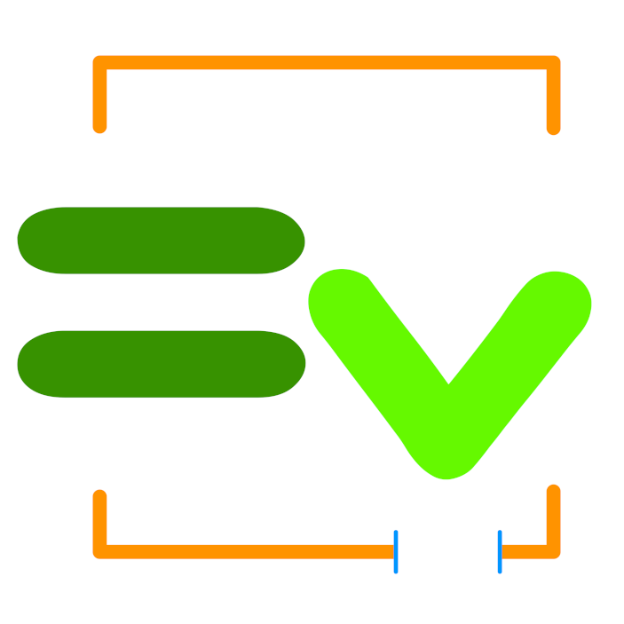

</img>
# Downloadable ChucK Packages

This is a listing of all available packages that can be downloaded and installed using  [**ChuMP**](../../chump/)—ChucK's (all-new) package manager for macOS, Linux, and Windows. As of ChucK `1.5.5.0`, ChuMP is bundled with the [ChucK release](../) on macOS and Windows (Linux users can [build from source](../../chump/linux-build.html)). Many more packages are on the way, from both the ChucK community and ChucK Team. Please visit the [ChuMP site](../../chump/) for more information on using and contributing to ChuMP.

BTW it is also possible to browse packages using ChuMP in terminal:

```txt
  chump list
```
To list packages currently installed on your computer:
```text
  chump list -i
```

# Available Packages

* [**AudLabels**](./AudLabels/): Provides AudLabels, a utility class to read Audacity label files
* [**ChuGUI**](./ChuGUI/): ChuGUI is a flexible immediate-mode 2D GUI toolkit for ChuGL.
* [**Chumpinate**](./Chumpinate/): Two classes (Package and PackageVersion) to faciliate creating new packages for ChuMP
* [**CKTest**](./CKTest/): A testing libary and framework for ChucK. Contains assert() and expect() functions.
* [**DMX**](./DMX/): ChucK-DMX: A plugin for ChucK that enables the sending of DMX over serial or over ethernet via the ArtNet and sACN network protocols.
* [**FluidSynth**](./FluidSynth/): A UGen for loading and rendering soundfonts
* [**HashMap**](./HashMap/): Generic HashMap + JSON parser
* [**Hydra**](./Hydra/): A wrapper for the Python configuration framework Hydra
* [**Line**](./Line/): A UGen for creating envelopes of arbitrary ramps (ala Max/PD's line~ object)
* [**Patch**](./Patch/): A tool for update control values from UGens
* [**PlinkyRev**](./PlinkyRev/): A stereo reverb UGen using Plinky synth's reverb (https://plinkysynth.com/)
* [**Range**](./Range/): A UGen that linearly maps an input range to an output range.
* [**Rave**](./Rave/): A UGen to load and synthesize real-time audio from variational autoencoder models. Based on IRCAM's RAVE (Realtime Audio Variational autoEncoder) by Caillon and Esling. (See https://github.com/acids-ircam/RAVE for more info.)
* [**Rec**](./Rec/): Helper functions for recording to audio files. Supports recording from dac, UGens, and arrays of UGens.
* [**SideWarp**](./SideWarp/): Dynamic playback-rate adjusting via a sidechain. A fun disk-scratching effect
* [**smuck**](./smuck/): A framework for symbolic music notation and playback in ChucK
* [**WarpBuf**](./WarpBuf/): A UGen for high-quality time-stretching and pitch-shifting of audio files; also supports Ableton .asd files
