# SMucK Chord/Scale Dictionary

This page details rules for entering chords and scales in SMucK, including helpful "dictionary definitions" of scale types and chord extensions.

**Table of Contents**
- [SMucK Scale Input](#smuck-scale-input)
  - [Major/Minor](#majorminor)
  - [Pentatonic/Hexatonic](#pentatonichexatonic)
  - [Symmetric](#symmetric)
  - [Greek Modes](#greek-modes)
  - [Altered Modes](#altered-modes)
  - ["Exotic" Scales](#exotic-scales)
- [SMucK Chord Input](#smuck-chord-input)
  - [Basic Usage](#basic-usage)
  - [Triads](#triads)
  - [Extensions](#extensions)
  - [Chord Glossary](#chord-glossary)
  - [Feedback](#feedback)

# SMucK Scale Input
The `Smuckish` class has the method `.scale()` which allows for easy conversion of scale names to MIDI note numbers. It optionally takes an additional argument to specify the root note of the scale. Example usage:

```
// Basic usage
Smuckish.scale("major") @=> int my_scale[]; 
// my_scale is now an array of MIDI note numbers [0, 2, 4, 5, 7, 9, 11]

// Specify root note as int
Smuckish.scale("major", 60) @=> int my_scale[]; 
// my_scale is now an array of MIDI note numbers [60, 62, 64, 65, 67, 69, 71]

// Specify root note as string
Smuckish.scale("major", "c5") @=> int my_scale[]; 
// my_scale is now an array of MIDI note numbers [72, 74, 76, 77, 79, 81, 83]
```

A full list of the supported scale names and their definitions can be found below. All scales are shown starting on root note C.

## Major/Minor

<div style="text-align: center;">
  
  <p style="font-style: italic;">Major scale: <code>"major"</code></p>
</div>
<div style="text-align: center;">
  
  <p style="font-style: italic;">Minor scale: <code>"minor"</code></p>
</div>
<div style="text-align: center;">
  
  <p style="font-style: italic;">Melodic minor scale: <code>"melodic_minor"</code></p>
</div>
<div style="text-align: center;">
  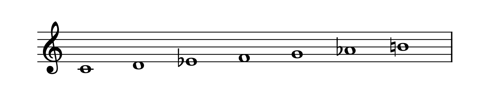
  <p style="font-style: italic;">Harmonic minor scale: <code>"harmonic_minor"</code></p>
</div>

## Pentatonic/Hexatonic
<div style="text-align: center;">
  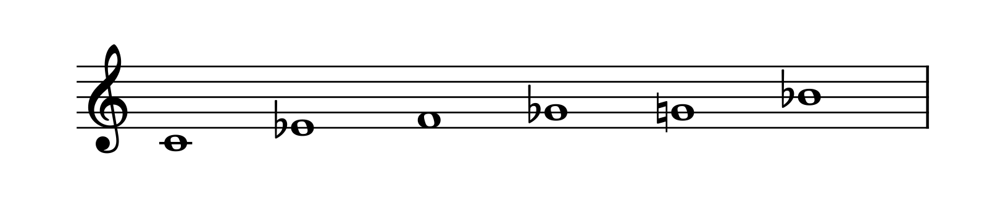
  <p style="font-style: italic;">Blues scale: <code>"blues"</code></p>
</div>
<div style="text-align: center;">
  
  <p style="font-style: italic;">Major pentatonic scale: <code>"major_pentatonic"</code></p>
</div>
<div style="text-align: center;">
  
  <p style="font-style: italic;">Minor pentatonic scale: <code>"minor_pentatonic"</code></p>
</div>
<div style="text-align: center;">
  
  <p style="font-style: italic;">Major hexatonic scale: <code>"major_hexatonic"</code></p>
</div>
<div style="text-align: center;">
  
  <p style="font-style: italic;">Minor hexatonic scale: <code>"minor_hexatonic"</code></p>
</div>

## Symmetric
<div style="text-align: center;">
  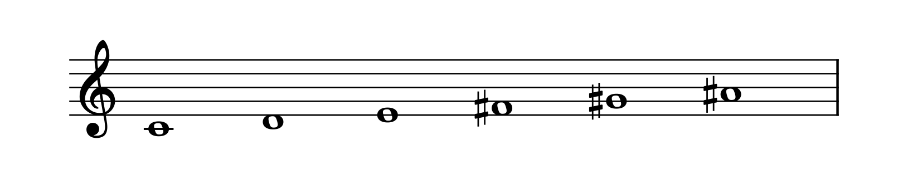
  <p style="font-style: italic;">Whole tone scale: <code>"wholetone"</code></p>
</div>
<div style="text-align: center;">
  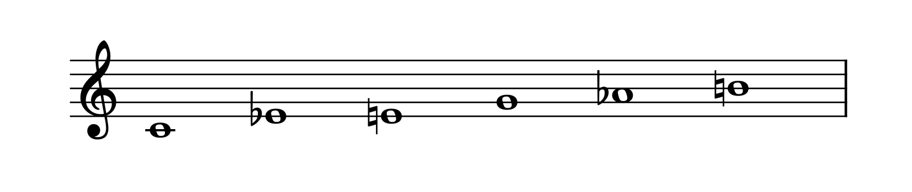
  <p style="font-style: italic;">Augmented scale: <code>"augmented"</code></p>
</div>
<div style="text-align: center;">
  
  <p style="font-style: italic;">Half-whole Octatonic scale: <code>"half_whole"</code></p>
</div>
<div style="text-align: center;">
  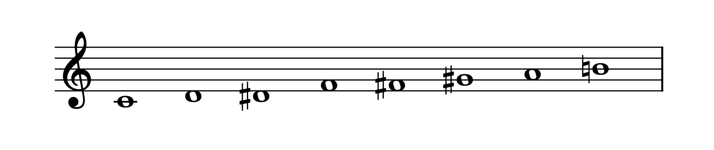
  <p style="font-style: italic;">Whole-half Octatonic scale: <code>"whole_half"</code></p>
</div>

## Greek Modes

<div style="text-align: center;">
  
  <p style="font-style: italic;">Ionian mode: <code>"ionian"</code></p>
</div>
<div style="text-align: center;">
  
  <p style="font-style: italic;">Dorian mode: <code>"dorian"</code></p>
</div>
<div style="text-align: center;">
  
  <p style="font-style: italic;">Phrygian mode: <code>"phrygian"</code></p>
</div>
<div style="text-align: center;">
  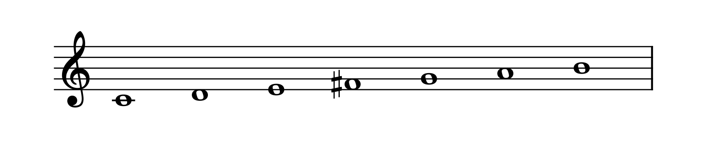
  <p style="font-style: italic;">Lydian mode: <code>"lydian"</code></p>
</div>
<div style="text-align: center;">
  
  <p style="font-style: italic;">Mixolydian mode: <code>"mixolydian"</code></p>
</div>
<div style="text-align: center;">
  
  <p style="font-style: italic;">Aeolian mode: <code>"aeolian"</code></p>
</div>
<div style="text-align: center;">
  
  <p style="font-style: italic;">Locrian mode: <code>"locrian"</code></p>
</div>

## Altered Modes

<div style="text-align: center;">
  
  <p style="font-style: italic;">Major harmonic scale: <code>"major_harmonic"</code></p>
</div>
<div style="text-align: center;">
  
  <p style="font-style: italic;">Minor harmonic scale: <code>"minor_harmonic"</code></p>
</div>
<div style="text-align: center;">
  
  <p style="font-style: italic;">Phrygian dominant scale: <code>"phrygian_dominant"</code></p>
</div>
<div style="text-align: center;">
  
  <p style="font-style: italic;">Lydian dominant scale: <code>"lydian_dominant"</code></p>
</div>
<div style="text-align: center;">
  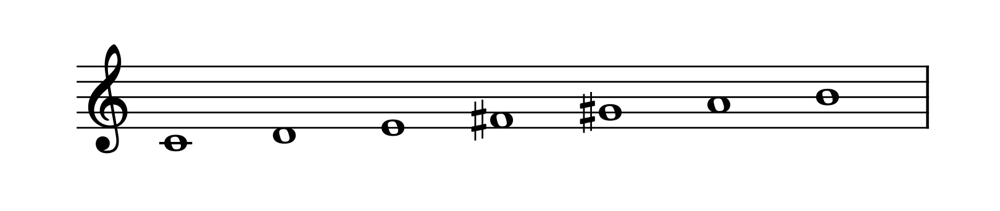
  <p style="font-style: italic;">Lydian augmented scale: <code>"lydian_augmented"</code></p>
</div>
<div style="text-align: center;">
  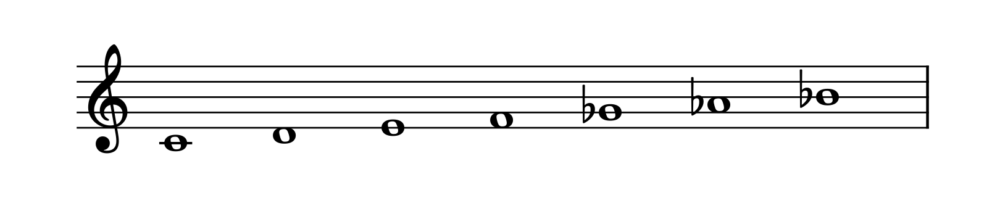
  <p style="font-style: italic;">Major locrian scale: <code>"major_locrian"</code></p>
</div>
<div style="text-align: center;">
  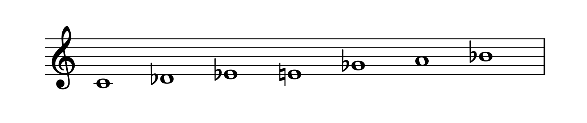
  <p style="font-style: italic;">Supralocrian scale: <code>"supralocrian"</code></p>
</div>
<div style="text-align: center;">
  
  <p style="font-style: italic;">Neapolitan major scale: <code>"neapolitan_major"</code></p>
</div>
<div style="text-align: center;">
  
  <p style="font-style: italic;">Neapolitan minor scale: <code>"neapolitan_minor"</code>  </p>
</div>
<div style="text-align: center;">
  
  <p style="font-style: italic;">Half diminished scale: <code>"half_diminished"</code></p>
</div>

## "Exotic" Scales

<div style="text-align: center;">
  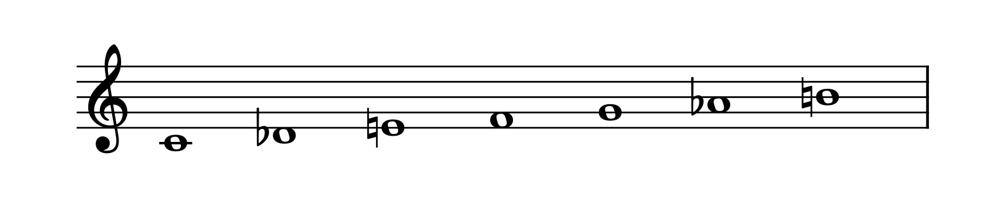
  <p style="font-style: italic;">Double harmonic scale: <code>"double_harmonic"</code></p>
</div>
<div style="text-align: center;">
  
  <p style="font-style: italic;">Enigmatic scale: <code>"enigmatic"</code></p>
</div>
<div style="text-align: center;">
  
  <p style="font-style: italic;">"Gypsy" scale: <code>"gypsy"</code></p>
</div>
<div style="text-align: center;">
  
  <p style="font-style: italic;">Hungarian minor scale: <code>"hungarian_minor"</code></p>
</div>
<div style="text-align: center;">
  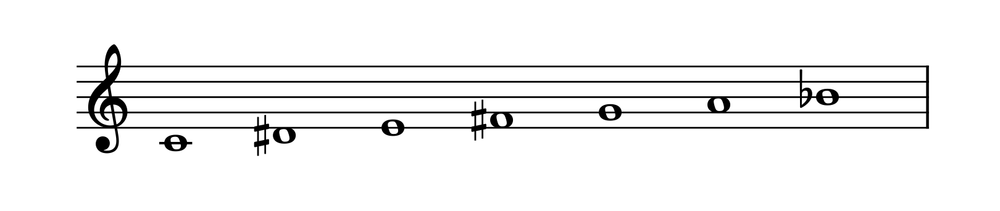
  <p style="font-style: italic;">Hungarian major scale: <code>"hungarian_major"</code></p>
</div>
<div style="text-align: center;">
  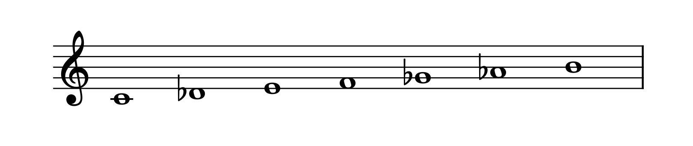
  <p style="font-style: italic;">Persian scale: <code>"persian"</code></p>
</div>
<div style="text-align: center;">
  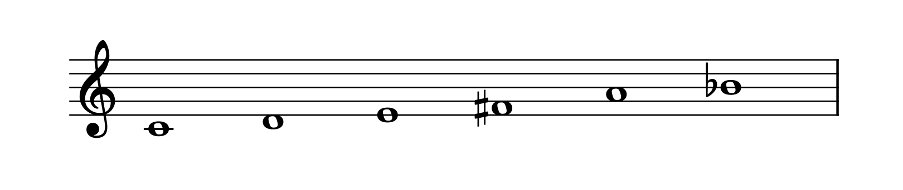
  <p style="font-style: italic;">Prometheus scale: <code>"prometheus"</code></p>
</div>
<div style="text-align: center;">
  
  <p style="font-style: italic;">In scale: <code>"in"</code></p>
</div>
<div style="text-align: center;">
  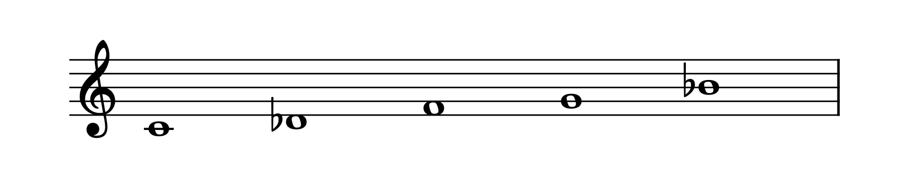
  <p style="font-style: italic;">Insen scale: <code>"insen"</code></p>
</div>
<div style="text-align: center;">
  
  <p style="font-style: italic;">Iwato scale: <code>"iwato"</code></p>
</div>
<div style="text-align: center;">
  
  <p style="font-style: italic;">Yo scale: <code>"yo"</code></p>
</div>

# SMucK Chord Input

The `Smuckish` class has the method `.chord()` which allows for quick parsing of chord symbols into `int` arrays of MIDI note numbers. This tool is able to handle chord symbols typically used in jazz/popular music (i.e. "Cmaj7", "G#m7", "Bbdim", "F#sus4", etc). Certain kinds of chord naming conventions are not supported (yet), like inversions,"slash" chords, and some complex altered extensions. This page outlines the supported chord symbols, their definitions, and examples of usage. 

It is also important to note that arbitrary chords can be constructed using SMucKish syntax by connecting multiple pitches with the `:` symbol. The `Smuckish.chord()` method is meant as a standalone tool for parsing chord symbols into MIDI note numbers. 

## Basic Usage

Here is a basic example of how to use the `Smuckish.chord()` method:

```
// Basic usage
Smuckish.chord("C"); // This returns [0, 4, 7]

Smuckish.chord("Ebmin"); // This returns [3, 6, 10]

// Specify the octave
Smuckish.chord("Ebmin", 4) // This returns [63, 66, 70]
```

The format for chord symbols read by the `Smuckish.chord()` method is a single string with the following structure:

```
[ROOT][TRIAD][EXTENSION]
```

- `ROOT` consists of 1-3 characters representing the root note of the chord. The first character is required. It represents the pitch step (e.g. `a`, `b`, `c`) and may be upper or lower case. The second and third characters, representing the accidental (e.g. `#`, `b`, `##`, `bb`), are optional.
- `TRIAD` is 3 characters long and represents the chord's basic triad (e.g. `maj`, `min`). If omitted, the chord is considered to contain a major triad. A full list of accepted triad types can be found below.
- `EXTENSION` can be arbitrarily long and represents the extended chord tones beyond the triad (e.g. `7`, `9`). These extensions are optional and can also be altered with accidentals (e.g. `b9`, `#11`).

Passing the resulting string to the `Smuckish.chord()` method will return the MIDI note numbers for the chord, in octave 0. To specify a different octave, pass the octave number as an `int` in the second argument.

## Triads

These are the following triad types allowed in the `TRIAD` field:

<div style="text-align: center;">
  
  <p style="font-style: italic;">Major triad: <code>"maj"</code></p>
</div>
<div style="text-align: center;">
  
  <p style="font-style: italic;">Minor triad: <code>"min"</code></p>
</div>
<div style="text-align: center;">
  
  <p style="font-style: italic;">Diminished triad: <code>"dim"</code></p>
</div>
<div style="text-align: center;">
  
  <p style="font-style: italic;">Augmented triad: <code>"aug"</code></p>
</div>
<div style="text-align: center;">
  
  <p style="font-style: italic;">Suspended 4th chord: <code>"sus"</code></p>
</div>


## Extensions

The `EXTENSION` field contains chord tones beyond the triad. Valid extension values are: `6`, `7`, `9`, `11`, `13`, `b9`, `#9`, `#11`, and `b13`. Some chord tones are "inferred" from the triad. For instance, a `maj7` places a major seventh above the root note, while a `min7` places a minor seventh above the root note. Also, higher extensions such as `9`, `11`, and `13` also imply the presence of lower extensions. For example, a `maj9` chord contains a major seventh and a ninth, and a `min11` chord contains a minor seventh, a ninth, and the eleventh. This is done in accordance with the "common practice" chord naming conventions. A complete list of all supported extensions and their definitions can be found below.

### Seventh Chords

<div style="text-align: center;">
  
  <p style="font-style: italic;">Major 7th chord: <code>"maj7"</code></p>
</div>

<div style="text-align: center;">
  
  <p style="font-style: italic;">Dominant 7th chord: <code>"dom7" or just "7"</code></p>
</div>

<div style="text-align: center;">
  
  <p style="font-style: italic;">Minor 7th chord: <code>"min7"</code></p>
</div>

<div style="text-align: center;">
  
  <p style="font-style: italic;">Minor 7th flat 5 (half-diminished)chord: <code>"min7b5"</code></p>
</div>

<div style="text-align: center;">
  
  <p style="font-style: italic;">Diminished 7th (fully diminished)chord: <code>"dim7"</code></p>
</div>

<div style="text-align: center;">
  
  <p style="font-style: italic;">Augmented 7th chord: <code>"aug7"</code></p>
</div>

<div style="text-align: center;">
  
  <p style="font-style: italic;">Suspended 4th 7th chord: <code>"sus7"</code></p>
</div>

(Not technically seventh chords, but they have 4 notes)

<div style="text-align: center;">
  
  <p style="font-style: italic;">Major 6th chord: <code>"maj6" or just "6"</code></p>
</div>

<div style="text-align: center;">
  
  <p style="font-style: italic;">Minor 6th chord: <code>"min6"</code></p>
</div>

### Ninth, Eleventh, and Thirteenth Chords

Ninth, eleventh, and thirteenth chords have the following behavior:
- When a ninth chord is specified, it is parsed the same as a seventh chord, but with the addition of a major ninth above the root. 
- When an eleventh chord is specified, it is parsed the same as a ninth chord, but with the addition of a perfect eleventh above the root.
- When a thirteenth chord is specified, it is parsed the same as a **ninth** chord, but with the addition of a major thirteenth above the root. NOTE: the eleventh is not "implied" with thirteenth chords.

### Alterations

Any of the upper extensions (9th, 11th, or 13th) can be altered with a sharp (`#`) or flat (`b`) symbol. 

- Both `b9` and `#9` and valid and can exist simultaneously.
- `b11` and `#11` are both technically valid, but `b11` is enharmonically equivalent to the major 3rd, so it is generally not used.
- `b13` and `#13` are both technically valid, but `#13` is enharmonically equivalent to the minor 7th, so it is generally not used.

Any combination of these alterations is valid. For example, the chord `C7b9#11b13` will give the following:

<div style="text-align: center;">
  
  <p style="font-style: italic;">Altered 7th chord: <code>"C7b9#11b13"</code></p>
</div>


## Chord Glossary

For convenience, here is a list of extended chords and their appropriate chord symbols. Some of these chords are not typically used (especially some of the 11th chords, like "maj11"), but are still technically valid entries so are included.

### Ninth Chords

<div style="text-align: center;">
  
  <p style="font-style: italic;">Major 9th chord: <code>"maj9"</code></p>
</div>

<div style="text-align: center;">
  
  <p style="font-style: italic;">Dominant 9th chord: <code>"dom9" or just "9"</code></p>
</div>

<div style="text-align: center;">
  
  <p style="font-style: italic;">Minor 9th chord: <code>"min9"</code></p>
</div>

<div style="text-align: center;">
  
  <p style="font-style: italic;">Minor 9th flat 5 chord: <code>"min9b5"</code></p>
</div>

<div style="text-align: center;">
  
  <p style="font-style: italic;">Diminished 9th chord: <code>"dim9"</code></p>
</div>

<div style="text-align: center;">
  
  <p style="font-style: italic;">Augmented 9th chord: <code>"aug9"</code></p>
</div>

<div style="text-align: center;">
  
  <p style="font-style: italic;">Suspended 9th chord: <code>"sus9"</code></p>
</div>

### Eleventh Chords

<div style="text-align: center;">
  
  <p style="font-style: italic;">Major 11th chord (DUBIOUS): <code>"maj11"</code></p>
</div>

<div style="text-align: center;">
  
  <p style="font-style: italic;">Dominant 11th chord (DUBIOUS): <code>"dom11" or just "11"</code></p>
</div>

<div style="text-align: center;">
  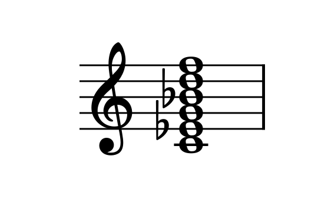
  <p style="font-style: italic;">Minor 11th chord: <code>"min11"</code></p>
</div>

<div style="text-align: center;">
  
  <p style="font-style: italic;">Diminished 11th chord: <code>"dim11"</code></p>
</div>

<div style="text-align: center;">
  
  <p style="font-style: italic;">Augmented 11th chord (DUBIOUS): <code>"aug11"</code></p>
</div>

<div style="text-align: center;">
  
  <p style="font-style: italic;">Suspended 11th chord (DUBIOUS): <code>"sus11"</code></p>
</div>

### Thirteenth Chords

<div style="text-align: center;">
  
  <p style="font-style: italic;">Major 13th chord: <code>"maj13"</code></p>
</div>

<div style="text-align: center;">
  
  <p style="font-style: italic;">Dominant 13th chord: <code>"dom13" or just "13"</code></p>
</div>

<div style="text-align: center;">
  
  <p style="font-style: italic;">Minor 13th chord: <code>"min13"</code></p>
</div>

<div style="text-align: center;">
  
  <p style="font-style: italic;">Diminished 13th chord: <code>"dim13"</code></p>
</div>

<div style="text-align: center;">
  
  <p style="font-style: italic;">Augmented 13th chord (DUBIOUS): <code>"aug13"</code></p>
</div>

<div style="text-align: center;">
  
  <p style="font-style: italic;">Suspended 13th chord: <code>"sus13"</code></p>
</div>


## Feedback

This tool is still in development! Some of this parsing might not work as expected. There also may be other chord symbols or types that are not supported yet. Please let me know (tae1han@stanford.edu) if you find any issues or have any suggestions for improvements!