# SMucK Scale Dictionary

**Table of Contents**
- [SMucK Scale Input](#smuck-scale-input)
- [Major/Minor](#majorminor)
- [Pentatonic/Hexatonic](#pentatonichexatonic)
- [Symmetric](#symmetric)
- [Greek Modes](#greek-modes)
- [Altered Modes](#altered-modes)
- ["Exotic" Scales](#exotic-scales)

## SMucK Scale Input
The `Smuckish` class has the method `.scale()` which allows for easy conversion of scale names to MIDI note numbers. It optionally takes an additional argument to specify the root note of the scale. Example usage:

```
// Basic usage
Smuckish.scale("major") @=> int my_scale[]; 
// my_scale is now an array of MIDI note numbers [0, 2, 4, 5, 7, 9, 11]

// Specify root note as int
Smuckish.scale("major", 60) @=> int my_scale[]; 
// my_scale is now an array of MIDI note numbers [60, 62, 64, 65, 67, 69, 71]

// Specify root note as string
Smuckish.scale("major", "c5") @=> int my_scale[]; 
// my_scale is now an array of MIDI note numbers [72, 74, 76, 77, 79, 81, 83]
```

A full list of the supported scale names and their definitions can be found below. All scales are shown starting on root note C.

## Major/Minor

<div style="text-align: center;">
  
  <p style="font-style: italic;">Major scale: <code>"major"</code></p>
</div>
<div style="text-align: center;">
  
  <p style="font-style: italic;">Minor scale: <code>"minor"</code></p>
</div>
<div style="text-align: center;">
  
  <p style="font-style: italic;">Melodic minor scale: <code>"melodicminor"</code></p>
</div>
<div style="text-align: center;">
  
  <p style="font-style: italic;">Harmonic minor scale: <code>"harmonicminor"</code></p>
</div>

## Pentatonic/Hexatonic
<div style="text-align: center;">
  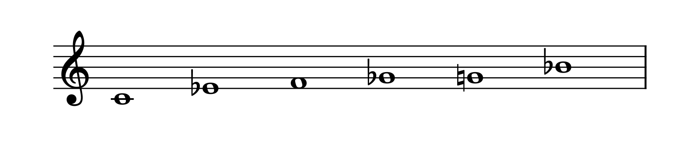
  <p style="font-style: italic;">Blues scale: <code>"blues"</code></p>
</div>
<div style="text-align: center;">
  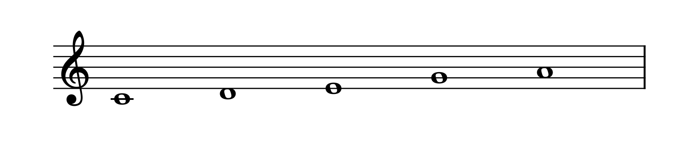
  <p style="font-style: italic;">Major pentatonic scale: <code>"major_pentatonic"</code></p>
</div>
<div style="text-align: center;">
  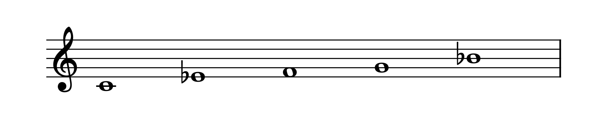
  <p style="font-style: italic;">Minor pentatonic scale: <code>"minor_pentatonic"</code></p>
</div>
<div style="text-align: center;">
  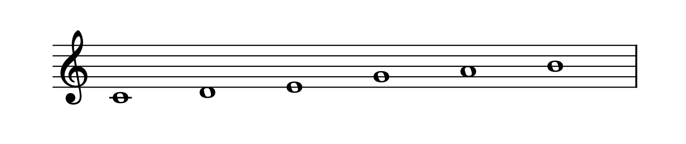
  <p style="font-style: italic;">Major hexatonic scale: <code>"major_hexatonic"</code></p>
</div>
<div style="text-align: center;">
  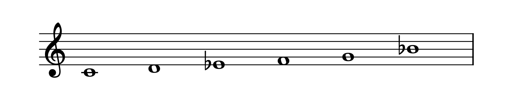
  <p style="font-style: italic;">Minor hexatonic scale: <code>"minor_hexatonic"</code></p>
</div>

## Symmetric
<div style="text-align: center;">
  
  <p style="font-style: italic;">Whole tone scale: <code>"wholetone"</code></p>
</div>
<div style="text-align: center;">
  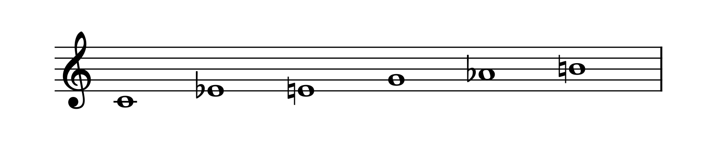
  <p style="font-style: italic;">Augmented scale: <code>"augmented"</code></p>
</div>
<div style="text-align: center;">
  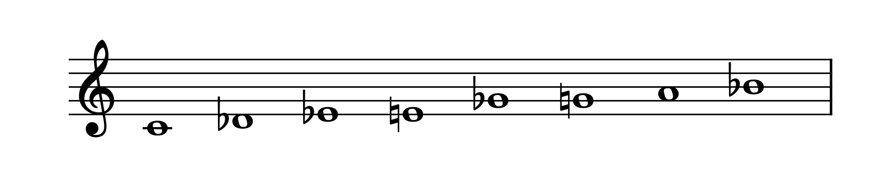
  <p style="font-style: italic;">Half-whole Octatonic scale: <code>"half_whole"</code></p>
</div>
<div style="text-align: center;">
  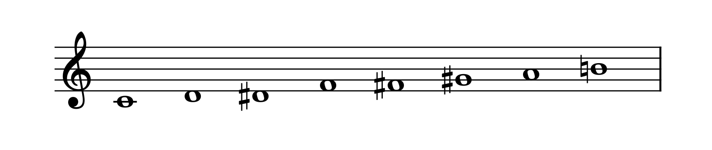
  <p style="font-style: italic;">Whole-half Octatonic scale: <code>"whole_half"</code></p>
</div>

## Greek Modes

<div style="text-align: center;">
  
  <p style="font-style: italic;">Ionian mode: <code>"ionian"</code></p>
</div>
<div style="text-align: center;">
  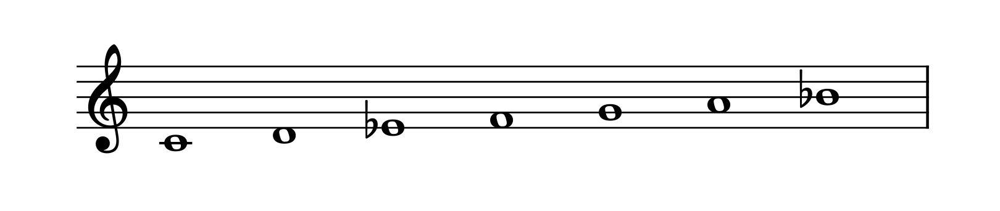
  <p style="font-style: italic;">Dorian mode: <code>"dorian"</code></p>
</div>
<div style="text-align: center;">
  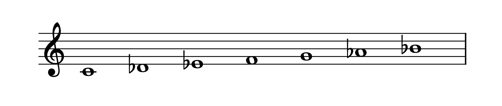
  <p style="font-style: italic;">Phrygian mode: <code>"phrygian"</code></p>
</div>
<div style="text-align: center;">
  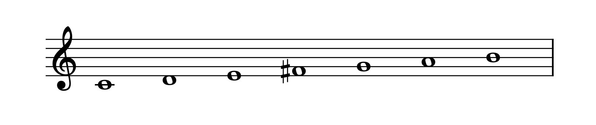
  <p style="font-style: italic;">Lydian mode: <code>"lydian"</code></p>
</div>
<div style="text-align: center;">
  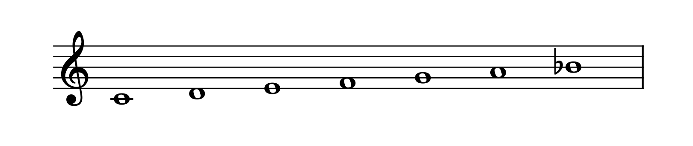
  <p style="font-style: italic;">Mixolydian mode: <code>"mixolydian"</code></p>
</div>
<div style="text-align: center;">
  
  <p style="font-style: italic;">Aeolian mode: <code>"aeolian"</code></p>
</div>
<div style="text-align: center;">
  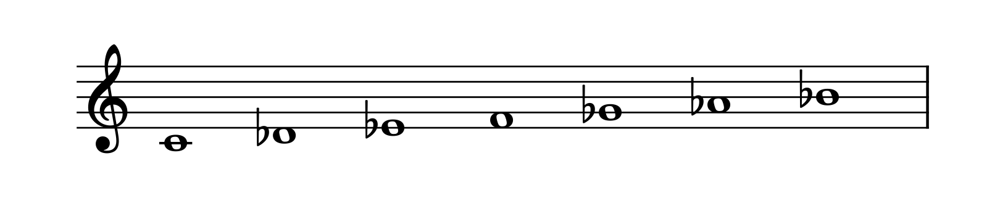
  <p style="font-style: italic;">Locrian mode: <code>"locrian"</code></p>
</div>

## Altered Modes

<div style="text-align: center;">
  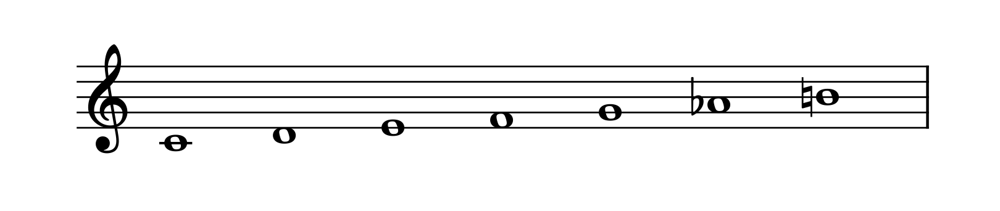
  <p style="font-style: italic;">Major harmonic scale: <code>"major_harmonic"</code></p>
</div>
<div style="text-align: center;">
  
  <p style="font-style: italic;">Minor harmonic scale: <code>"minor_harmonic"</code></p>
</div>
<div style="text-align: center;">
  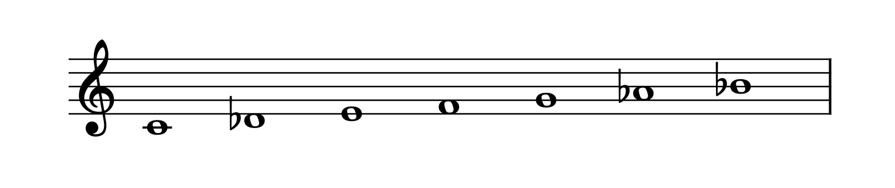
  <p style="font-style: italic;">Phrygian dominant scale: <code>"phrygian_dominant"</code></p>
</div>
<div style="text-align: center;">
  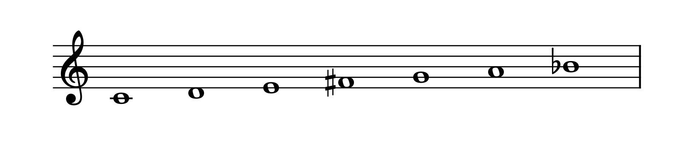
  <p style="font-style: italic;">Lydian dominant scale: <code>"lydian_dominant"</code></p>
</div>
<div style="text-align: center;">
  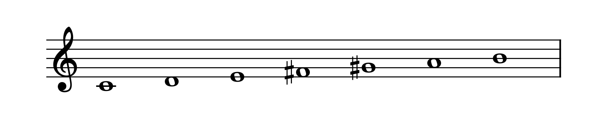
  <p style="font-style: italic;">Lydian augmented scale: <code>"lydian_augmented"</code></p>
</div>
<div style="text-align: center;">
  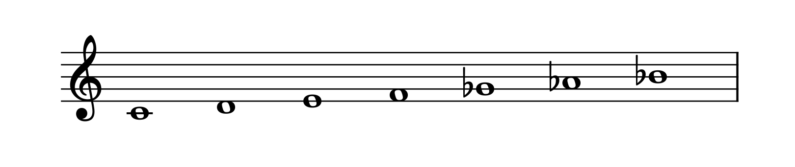
  <p style="font-style: italic;">Major locrian scale: <code>"major_locrian"</code></p>
</div>
<div style="text-align: center;">
  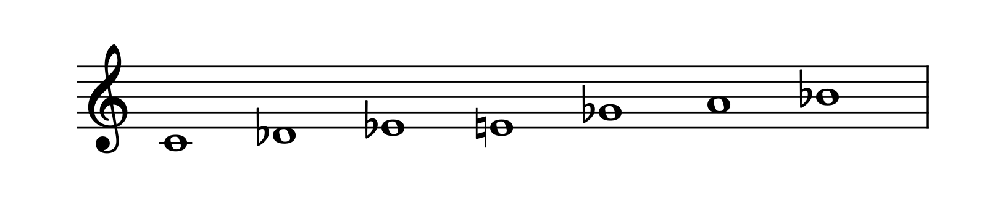
  <p style="font-style: italic;">Supralocrian scale: <code>"supralocrian"</code></p>
</div>
<div style="text-align: center;">
  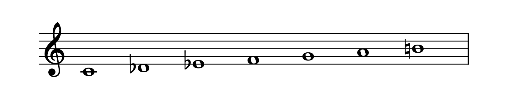
  <p style="font-style: italic;">Neapolitan major scale: <code>"neapolitan_major"</code></p>
</div>
<div style="text-align: center;">
  
  <p style="font-style: italic;">Neapolitan minor scale: <code>"neapolitan_minor"</code>  </p>
</div>
<div style="text-align: center;">
  
  <p style="font-style: italic;">Half diminished scale: <code>"half_diminished"</code></p>
</div>

## "Exotic" Scales

<div style="text-align: center;">
  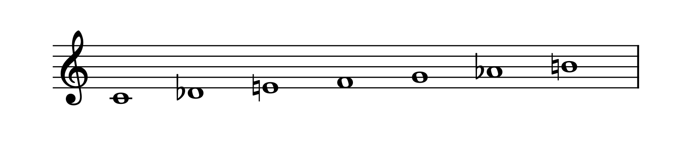
  <p style="font-style: italic;">Double harmonic scale: <code>"double_harmonic"</code></p>
</div>
<div style="text-align: center;">
  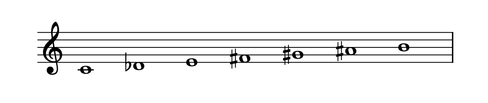
  <p style="font-style: italic;">Enigmatic scale: <code>"enigmatic"</code></p>
</div>
<div style="text-align: center;">
  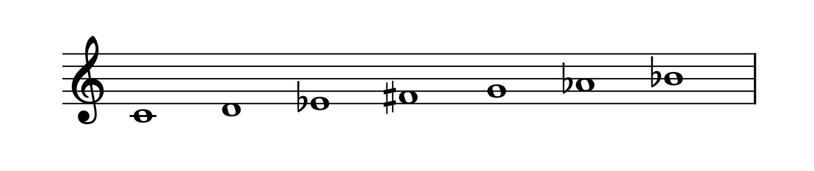
  <p style="font-style: italic;">"Gypsy" scale: <code>"gypsy"</code></p>
</div>
<div style="text-align: center;">
  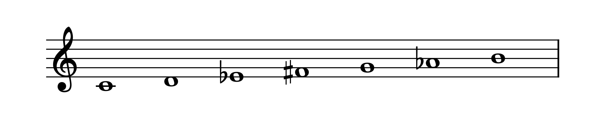
  <p style="font-style: italic;">Hungarian minor scale: <code>"hungarian_minor"</code></p>
</div>
<div style="text-align: center;">
  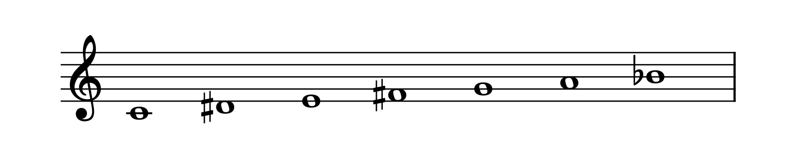
  <p style="font-style: italic;">Hungarian major scale: <code>"hungarian_major"</code></p>
</div>
<div style="text-align: center;">
  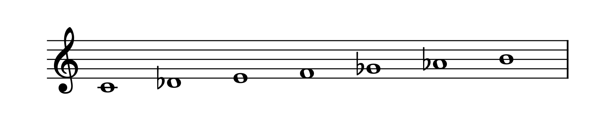
  <p style="font-style: italic;">Persian scale: <code>"persian"</code></p>
</div>
<div style="text-align: center;">
  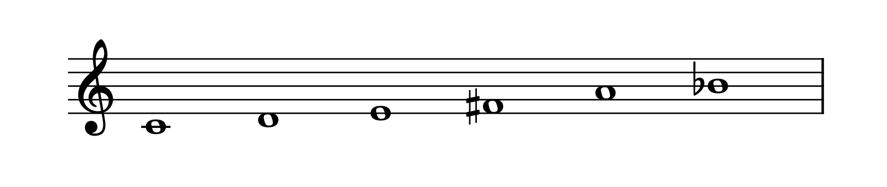
  <p style="font-style: italic;">Prometheus scale: <code>"prometheus"</code></p>
</div>
<div style="text-align: center;">
  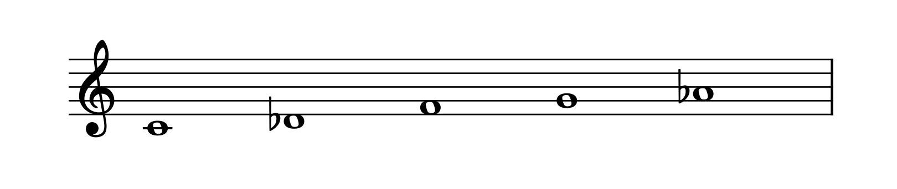
  <p style="font-style: italic;">In scale: <code>"in"</code></p>
</div>
<div style="text-align: center;">
  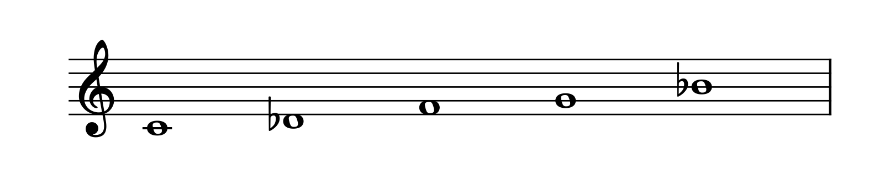
  <p style="font-style: italic;">Insen scale: <code>"insen"</code></p>
</div>
<div style="text-align: center;">
  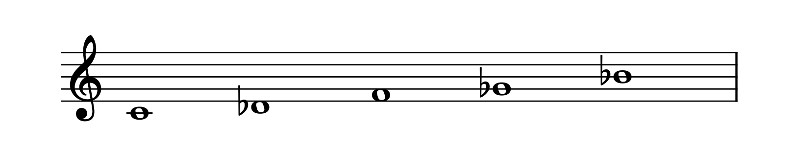
  <p style="font-style: italic;">Iwato scale: <code>"iwato"</code></p>
</div>
<div style="text-align: center;">
  
  <p style="font-style: italic;">Yo scale: <code>"yo"</code></p>
</div>
