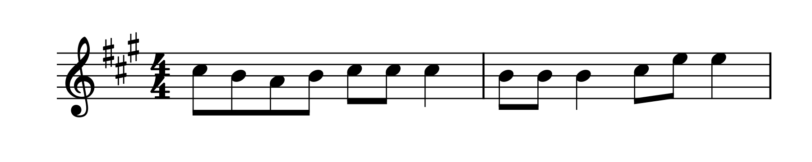
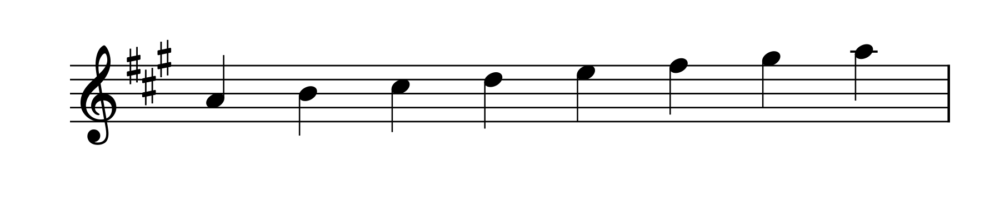
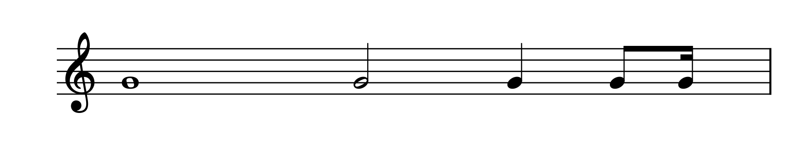
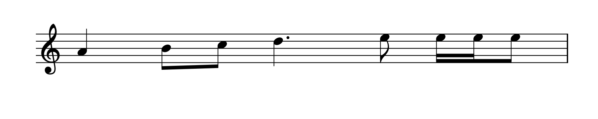

# SMucKish: The input language of SMucK

### Table of Contents
- [Pitch](#pitch)
    - [Construction of a Pitch](#construction-of-a-pitch)
    - [Proximity and Octaves](#proximity-and-octaves)
    - [Key Signatures and Accidentals](#key-signatures-and-accidentals)
    - [Chords](#chords)
    - [Rests](#rests)
- [Rhythm](#rhythm)
    - [Basic Rhythms](#basic-rhythms)
    - [Dotted Rhythms](#dotted-rhythms)
    - [Tuplets](#tuplets)
    - [Arbitrary Values](#arbitrary-values)
    - [Ties](#ties)
- [Dynamics](#dynamics)
    - [Velocities](#velocities)
    - [Dynamic Markings](#dynamic-markings)
- [Repeats](#repeats)
    - [Tokens](#tokens)
    - [Sequences](#sequences)
- [Multi-stage Input](#multi-stage-input)
- [Interleaved Input](#interleaved-input)
- [Using SMucKish](#using-smuckish)

# Overview
SMucKish is a symbolic music notation system for ChucK. It uses a custom syntax that is designed to encode musical information in a compact and high-level format. SMucKish is designed to provide a streamlined way to represent musical structures such as pitches, rhythms, dynamics, and more. Users can write SMucKish code as a string and parse it using a number of different functions and objects in the SMucK library. 

For example, if you wanted to encode this:




You could write the following SMucKish code to represent the pitches:
```
"k3s c5 b a b c c c b b b c e e"
```

<br>

You could use the `Smuckish.pitches()` function to parse this string into an int[][] array of MIDI note numbers. (We'll see why it's a 2D array later.)
```
Smuckish.pitches("k3s c5 b a b c c c b b b c e e"); // this returns [[73], [71], [69], [71], [73], [73], [73], [71], [71], [71], [73], [76], [76]]
```

<br>

Then, you could use the `Smuckish.rhythms()` function to parse this string into an float[] array of beat values.
```
Smuckish.rhythms("e e e e e e q e e q e e q"); // this returns [.5, .5, .5, .5, .5, .5, 1.0, .5, .5, 1.0, .5, .5, 1.0]
```

<br>

You could also write the pitches and rhythms in a single string and use this to instantiate an ezMeasure object (which contains a sequence of ezNote objects):
```
ezMeasure measure("k3s c5|e b a b c c c|q b|e b b|q c|e e e|q"); 
```

<br>

These are just some simple examples of how you can get started with SMucKish. There are more things you can do with SMucKish, like writing chords, dynamics, repeated patterns, and more. The following sections will cover different aspects of SMucKish syntax.


# Pitch

### Construction of a Pitch

Each pitch token is made up of 3 parts: a pitch step, an accidental, and an octave. The pitch step is a single character representing the note name (e.g. `a`, `b`, `c`) and is required. The accidental and octave parts may be multiple characters long and are optional.

Format:

```
[STEP][ACCIDENTAL (optional)][OCTAVE (optional)]
```
- `STEP` possible values:
  - `a`, `b`, `c`, `d`, `e`, `f`, `g`, `r` (rest)
- `ACCIDENTAL` possible values:
  - `#`, `b` (can be repeated an arbitrary number of times)
  - `n`
- `OCTAVE` possible values:
  - `0`, `1`, `2`,..., `INT_MAX`
  - `u` or `d` (can be repeated an arbitrary number of times)

For example, the following are all valid SMucKish pitches:
```txt
a
c#
db
fn
g#
gbb
c3
g#5
c#u
c#d
c#uuuuuu
c#dddddddddd (floor of MIDI note number 0 (C-1), or about 8hz)
c#99999 (this will be way too high to hear, but go ahead ¯\_(ツ)_/¯)
```


### Proximity and Octaves

If no octave number is initially set, SMucKish defaults to octave 4. 

The octave number does not need to be explicitly set for each note. By default, SMucKish assumes each pitch is in the octave that puts it closest to the previous pitch. So if the previous pitch was `a4`, and the current pitch is `c`, the current pitch will be in the octave of `c5`. In the case of a 6 semitone (tritone) jump (e.g. `c` to `f#`), which is the same distance away from either octave, the 2nd note will be in the higher octave.

Example showing proximity-based octave handling:
```
Smuckish.pitches("c d c e c f c f# c g c a c b c c");
```


We can also specify the octave **explicitly**. This overrides proximity-based octaves.
```
Smuckish.pitches("c1 c2 c3 c4 c5 c6 c7 c8");
```


We can also use `u`'s and `d`'s as a **shortcut** to move up and down octaves.
```
Smuckish.pitches("c4 eu c ed ed fuu");
```


### Key Signatures and Accidentals

Here we specify the key signature of A major (3 sharps).
To set a key signature, use a 3-character token starting with `k`, followed by the number of sharps or flats, and then the accidental (`b` or `#`). Think "key 3 sharps", "key 2 flats", etc. Key signatures can be set at any point in a SMucKish string and can be set multiple times.
```
Smuckish.pitches("k3# a b c d e f g a")
```


We can add accidentals (sharps, flats, naturals) to the notes, which override the key signature. Use `b` for flats, `#` for sharps, and `n` for naturals. While the **key signature 
persists** across a SMucKish string, **accidentals do not** and must be specified for each note.
```
Smuckish.pitches("k3# a b cn c d e f gb g a");
```


We can also specify an arbitrary number of sharps and flats. Sharps, flats, and naturals override the key signature.
```
Smuckish.pitches("c4 c# c## c##### cbbbbb");
```

### Chords

To enter chords, use a `:` in between each note. Note: sucessive pitches still follow proximity-based octave handling, even when they are part of a chord. Therefore, this input:

```
Smuckish.pitches("c:e:g c:e:g c:e:g");
```
Leads to this output:


because the second `c` uses the previous note `g` to determine proximity. 

Therefore, best practice for chords is to specify the octave for the leading note to eliminate any ambiguity:

```
Smuckish.pitches("c3:e:g c3:e:g c3:e:g");
```


There is also a function `Smuckish.chords()` that translates chord names directly into `int` arrays. For more information, see the [**SMucKChord Input Tool**](./chords.html) page.


### Rests

To enter a rest, simply use the `r` character in the pitch string. This is useful when combining multiple layers (pitch, rhythm, dynamics)--for example,if a note has `r` as its pitch value, and `q` as its rhythm value, it will be a quarter note rest.


# Rhythm
### Basic Rhythms

Rhythmic values are parsed floats representing beat value (NOT absolute durations). Basic subdivisions can be specified using `w` for whole notes, `h` for half notes, `q` for quarter notes, `e` for eighth notes, and `s` for sixteenth notes.

```
Smuckish.rhythms("w h q e s"); // This returns [4.0, 2.0, 1.0, 0.5, 0.25]
```



### Dotted Rhythms

Dotted rhythms are specified by adding a `.` after the rhythmic value. An arbitrary number of dots can be added.
```
Smuckish.rhythms("q q. q.. q... q...."); // This returns [1.0, 1.5, 1.75, 1.875, 1.9375]
```


### Tuplets

Basic triplets can be specified by adding a `t` before the rhythmic value.
```
Smuckish.rhythms("tq tq tq te te te")
```


Tuplets of other values can be specified by adding a `/` after the rhythmic value, followed by the tuplet division number. This performs a straightforward division of the rhythmic value, so `q/5` is 1 beat divided by 5, or .2 beats.
```
Smuckish.rhythms("q/5 q/7 q/13 q/23") // This returns [0.2, 0.14285714285714285, 0.07692307692307693, 0.043478260869565216]
```

### Arbitrary Values

Arbitrary float values can also be specified and are parsed as-is.
```
Smuckish.rhythms("q q 1.7 5.6 19.78") // This returns [1.0, 1.0, 1.7, 5.6, 19.78]
```

### Ties

Ties can be specified by adding a `_` at the start of the rhythmic value. For instance, the token `_q` will be tied to the previous note. The corresponding pitch will be dropped, so the previous note will have a rhythm that is the sum of the two tied notes's rhythms. This may lead to some unpredictable results depending on how the corresponding pitches are entered, so use with caution.

```
Smuckish.rhythms("q _q q") // This returns [2.0, 1.0]
```


# Dynamics

Dynamics/velocity values are parsed as `float` values that range from 0.0 to 1.0, NOT as MIDI velocity values.

### Velocities

Velocities can be explicitly specified by adding a `v` before an integer value.

```
Smuckish.velocities("v1.0 v.8 v.6 v.5 v.25") // This returns [1.0, .8, .6, .5, .25]
```

### Dynamic Markings

Dynamic markings from standard notation can be used ranging from `pppp` to `ffff`. Markings are mapped to float values between .1 and 1.0 as follows:


```
Smuckish.velocities("pppp ppp pp p pp mp mf f ff fff ffff") // This returns [.1, .2, .3, .4, .5, .6, .7, .8, .9, 1.0]
```

# Repeated tokens and sequences

One particularly useful feature of SMucKish is the ability to repeat individual pitch/rhythm/velocity tokens or even sequences of tokens.

To repeat a token, simply add a `x` immediately after the token (with no space), followed by the number of times to repeat the token.

```
Smuckish.rhythms("qx3 ex5") // This returns [1.0, 1.0, 1.0, 0.5, 0.5, 0.5, 0.5, 0.5]
```


To repeat a sequence of tokens, enclose the sequence in brackets `[` and `]`, followed by the number of times to repeat the sequence.

```
Smuckish.rhythms("[q ex2]x3") // This returns [1.0, 0.5, 0.5, 1.0, 0.5, 0.5, 1.0, 0.5, 0.5]
```


# Multi-stage Input

### Basic Multi-stage Input

Let's say you want to create a measure of music with specific pitches, rhythms, and dynamics. You can do this by specifying each "layer" of the measure separately. First we can create an empty `ezMeasure` object:

```
ezMeasure measure;
```

Then we can specify the pitches, rhythms, and dynamics separately.

```
measure.set_pitches("c4 d e f g");
measure.set_rhythms("tqx3 e e");
measure.set_velocities("mfx5");
```

This gives us a measure with all the layers "glued together" into `ezNote` objects. We can see the contents of the measure by calling `measure.print_notes()`, which will give the following output:

```
There are 5 notes in this measure:
Note 0: onset = 0, beats = 0.666667, pitch = C4, velocity = .6
Note 1: onset = 0.666667, beats = 0.666667, pitch = D4, velocity = .6
Note 2: onset = 1.33333, beats = 0.666667, pitch = E4, velocity = .6
Note 3: onset = 2, beats = 0.5, pitch = F4, velocity = .6
Note 4: onset = 2.5, beats = 0.5, pitch = G4, velocity = .6
```


You don't need to set all the layers. For example, if you only set the pitches, the rhythms and dynamics will be set to default values. Rhythms have a default value of 1.0 beats, and dynamics have a default value of 100. Pitches have a default value of 60 (MIDI note C4). You can also set the layers in any order.

### Multi-stage Input Overwriting

If you set a layer with a different number of tokens than the previous layer, missing values will be automatically set based on the context. For example, if we set a sequence of 5 pitches:

```
ezMeasure m1;
m1.set_pitches("a b c d e");
```

This creates a measure with 5 notes, each with a default rhythm of 1.0 beats and a default velocity of 100.


If we then set the rhythms to a sequence of 8 values:

```
m1.set_rhythms("q e e q. e s s e");
```

The measure will fill out to have 8 notes, with the last 3 notes having pitches of `e`, since that was the last pitch set.



If we then set the dynamics to a sequence of 3 values:

```
m1.set_velocities("f mf p");
```

The measure will still have 8 notes, with the last 5 notes having dynamics of `p`, since that was the last dynamics set.


# Interleaved Input

The "interleaved" input syntax is a way to specify pitch, rhythm, and dynamics in a single string. This can be useful for quickly specifying all the layers of the measure simultaneously.

To specify a single note's pitch, rhythm, and dynamic, use a `|` to separate the values to be combined into one note. 

If using interleaved input, the pitch value should come first, optionally followed by the rhythm and/or dynamics values. It is not necessary to use all three layers for each token. If one of the layers is not specified, it will be inferred from the previous note, as in multi-stage input. 

For example, the following input:
```
ezMeasure measure("ks1 c4|q|mf d e f g|e|mp a b c");
```

Produces the following output:


# Using SMucKish

There are two main ways to use SMucKish:

### 1. Directly parsing individual layers using `Smuckish` static functions

The `Smuckish` class contains a number of static functions that can be used to parse SMucKish strings into different data types. These functions are:

- `Smuckish.pitches()` : Parses a SMucKish string into an int[][] array of MIDI note numbers. Because SMucKish pitch sequences can be polyphonic, the output is a 2D array, indexed first by position in sequence, then by voice. 
- `Smuckish.rhythms()` : Parses a SMucKish string into a float[] array of beat values.
- `Smuckish.velocities()` : Parses a SMucKish string into an float[] array of velocity values.

### 2. Using ezScore objects

The ezScore family of objects are data structures designed to hold and manipulate musical information, and are primarily used for playback. These include `ezMeasure`, `ezPart`, and `ezScore`. To use SMucKish with these objects, you can use the following methods:

- `ezMeasure(string smuckish_string)` : Constructs an `ezMeasure` object from a SMucKish string.
- `ezMeasure.setPitches(string smuckish_string)` : Sets the pitches of the measure.
- `ezMeasure.setRhythms(string smuckish_string)` : Sets the rhythms of the measure.
- `ezMeasure.setVelocities(string smuckish_string)` : Sets the dynamics of the measure.

In these methods, the SMucKish string is translated into a sequence of `ezNote` objects. Each `ezNote` object contains a `pitch`, `beat` (rhythmic duration), `onset` (in beats, relative to the start of the measure), and `velocity`. Each `ezMeasure` object contains a `notes` array of `ezNote` objects.

The methods for `ezPart` and `ezScore` are identical--you can use either a constructor or the `setPitches()`, `setRhythms()`, and `setVelocities()` methods. For an `ezPart`, using these methods results in a part with a single `ezMeasure`. For an `ezScore`, using these methods results in a score with a single `ezPart` with a single `ezMeasure`.

For more information about the usage of these objects and their functions, see the [**SMucK API Reference**](../api/)