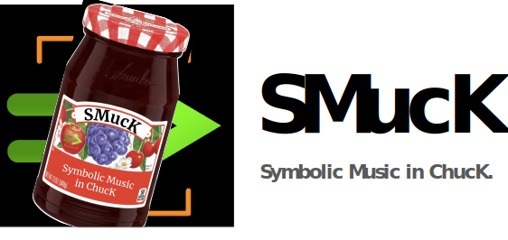

<div align="center">
<!-- Add ChuGL logo -->
<!--  -->

</img>

<h2>SMucK ~&gt; Symbolic Music in ChucK</h2>

</div> <!-- end center -->


<p align="justify">

<b>SMucK</b> is a framework for writing music in ChucK with symbolic music notation.


SMucK was created by <a href="https://ccrma.stanford.edu/~alexhan/">Alex Han</a>,
<a href="https://kiranvbhat.com/">Kiran Bhat</a>, and <a href="https://ccrma.stanford.edu/~ge/">Ge Wang</a>, 
with support from the <a href="../doc/authors.html">ChucK Team</a>.
</p>

<!--  -->

---

**SMucK v0.1.2** (alpha) — [**SMucK API Reference**](./api/)
• [**Examples**](./examples/)
• [**Basic Playback**](./doc/walkthru.html)
• [**SMucKish Rosetta Stone**](./doc/smuckish.html)
• [**Chord/Scale Dictionary**](./doc/dictionary.html)

<!--• [**SMucK Cheatsheet**](./doc/cheatsheet.html) -->

___

## Installing SMucK

1. Download ChucK version 1.5.5.0 or later. You can get the latest version [here](https://chuck.stanford.edu/release/).

2. To install SMucK, run the following command (which uses ChucK's new package manager, [ChuMP](https://chuck.stanford.edu/chump)):
```txt
chump install smuck
```

## Updating SMucK

To update to the latest version of SMucK, run the following command:

```txt
chump update smuck
```


## Running SMucK

### Minimal Example

If the SMucK library is properly loaded, the following example will run without errors:

```
// example.ck
@import "smuck"
```

Congrats, you now have SMucK properly installed!

## Learning SMucK
- To get started with SMucK, you can check out the [Basic Playback](./doc/walkthru.html) tutorial.
- To learn how to write musical notation using the SMucKish input syntax, check out the [SMucKish Rosetta Stone](./doc/smuckish.html).
- To learn about the SMucKish chord/scale entry rules, check out the [Chord/Scale Dictionary](./doc/dictionary.html).
- For an overview of SMucK's classes and their methods, check out the [API Reference](./api/).
- Check out the [Examples](./examples/) for more ways to use SMucK.

Happy SMucKing!


