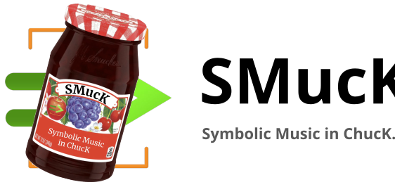

<div align="center">

</img>

<h2>SMucK ~&gt; Symbolic Music in ChucK</h2>

</div>

**SMucK** is a framework for writing music in ChucK with symbolic music notation.

SMucK was created by [Alex Han](https://ccrma.stanford.edu/~alexhan/),
[Kiran Bhat](https://kiranvbhat.com/), and [Ge Wang](https://ccrma.stanford.edu/~ge/), 
with support from the [ChucK Team](../doc/authors.html).

---

**SMucK v0.1.5** (alpha) — **[Documentation](./doc/docs.html)** • **[API Reference](./api/)** • **[Examples](./examples/)** • **[Version History](./VERSIONS.html)**

---

## Installing SMucK

1. Download ChucK version 1.5.5.0 or later. You can get the latest version [here](https://chuck.stanford.edu/release/).
2. To install SMucK, run the following command (which uses ChucK's package manager, [ChuMP](https://chuck.stanford.edu/chump)):

```txt
chump install smuck
```

1. Some parts of SMucK rely on other chugins. We highly recommend installing these as well:

```txt
chump install HashMap
chump install FluidSynth
```

## Updating SMucK

To update to the latest version of SMucK, run the following command:

```txt
chump update smuck
```

## Importing SMucK

If the SMucK library is properly loaded, the following example will run without errors:

```
@import "smuck"
```

Congrats, you now have SMucK properly installed!

SMucK classes that rely on external chugins (e.g. HashMap, FluidSynth) must be imported explicitly:

```
@import "smuck/ezFluidInst.ck"
@import "smuck/smIO.ck"
```

## Learning SMucK

- **[Documentation](./doc/docs.html)** — Hub for all guides: getting started, SMucKish, building/editing scores, MIDI import, ezInstrument, score I/O, chord dictionary.
- **[Basic Playback](./doc/walkthru.html)** — Minimal overview: create a score, attach instruments, play.
- **[API Reference](./api/)** — Class and method reference.
- **[Examples](./examples/)** — Example scripts.

Happy SMucKing!